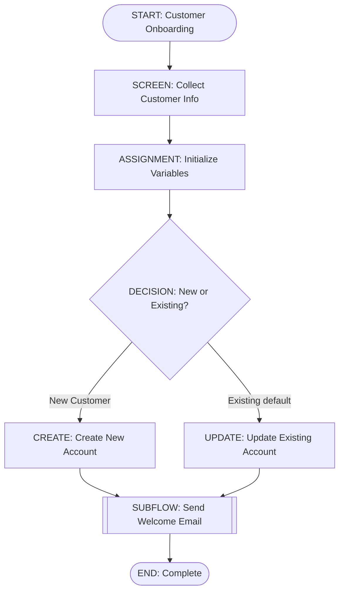

# Mermaid-to-Salesforce Flow Compiler

CLI tool to compile Mermaid flowcharts into Salesforce Flow metadata.

## Features

- ✅ **Full v1 Element Support**: Start, End, Assignment, Decision, Screen, RecordCreate, RecordUpdate, Subflow
- ✅ **Comprehensive Validation**: Structural + semantic validation with cycle detection
- ✅ **Documentation Generation**: Auto-generate Markdown docs and normalized Mermaid diagrams
- ✅ **Flow Analysis & Explain**: Analyze complexity, generate recommendations, and export reports (text/json/html)
- ✅ **Lint Command**: Validate flows without generating output
- ✅ **Interactive Mode**: Wizard to compile or create flows with live validation
- ✅ **Decompile Command**: Reverse Flow XML into DSL + Mermaid
- ✅ **Strict Mode**: Treat warnings as errors for stricter validation
- ✅ **Deterministic Output**: Same input always produces identical output (Git-friendly)

## Quick Start

### Installation

```bash
npm install
npm run build
```

### Compile a Flow

```bash
# Compile Mermaid to Salesforce Flow XML
mermaid-flow-compile compile \
  --input examples/v1/complete-flow.mmd \
  --out-flow output/flows \
  --out-json output/dsl \
  --out-docs output/docs

# Or use npm script
npm run cli -- compile --input examples/v1/complete-flow.mmd --out-flow output/flows
```

### Validate a Flow

```bash
# Lint a single file
mermaid-flow-compile lint --input my-flow.mmd

# Lint all flows in a directory
mermaid-flow-compile lint --input flows/

# Strict mode (warnings as errors)
mermaid-flow-compile lint --input my-flow.mmd --strict
```

### Analyze a Flow

```bash
# Generate text summary with complexity analysis
mermaid-flow-compile explain --input my-flow.mmd

# Export JSON report for CI/CD integration
mermaid-flow-compile explain --input my-flow.mmd --format json

# Generate HTML report
mermaid-flow-compile explain --input my-flow.mmd --format html > report.html
```

## Commands

### `compile`
Compile Mermaid flowchart to Salesforce Flow metadata.

**Options:**
- `--input <path>` - Path to Mermaid file (required)
- `--out-flow <dir>` - Output directory for Flow XML
- `--out-json <dir>` - Output directory for DSL JSON
- `--out-docs <dir>` - Output directory for documentation
- `--dsl-format <format>` - DSL format: json or yaml (default: json)
- `--strict` - Treat warnings as errors
- `--verbose` - Verbose logging
- `--debug` - Debug logging, stage timings, debug artifacts in `.debug/`
- `--watch` - Watch input file and recompile on changes

**Example:**
```bash
mermaid-flow-compile compile \
  --input my-flow.mmd \
  --out-flow flows/ \
  --out-json dsl/ \
  --out-docs docs/ \
  --strict \
  --verbose \
  --debug \
  --watch
```

### `lint`
Validate Mermaid flowchart without generating output.

**Options:**
- `--input <path>` - Path to Mermaid file or directory (required)
- `--strict` - Treat warnings as errors
- `--verbose` - Verbose logging
- `--debug` - Debug logging and stage timings
- `--watch` - Watch file/directory and re-run lint on changes

**Example:**
```bash
mermaid-flow-compile lint --input flows/ --strict
```

### `explain`
Analyze and summarize Flow structure, complexity, and generate recommendations.

**Options:**
- `--input <path>` - Path to Mermaid (.mmd) or DSL (.json/.yaml/.yml) file (required)
- `--format <format>` - Output format: `text`, `json`, or `html` (default: `text`)
- `--strict` - Treat warnings as errors
- `--verbose` - Verbose logging
- `--debug` - Debug logging and validation timings

**Example:**
```bash
# Text summary (default)
mermaid-flow-compile explain --input my-flow.mmd

# JSON output for programmatic analysis
mermaid-flow-compile explain --input my-flow.mmd --format json

# HTML report
mermaid-flow-compile explain --input my-flow.mmd --format html > report.html

# Interactive wizard (compile existing or create new)
mermaid-flow-compile interactive
```

**Output includes:**
- Flow metadata (API name, label, process type)
- Element counts by type (Screens, Assignments, Decisions, etc.)
- Cyclomatic complexity metric
- Decision outcomes count
- Variables count
- Validation errors and warnings
- **Recommendations** for improving flow quality:
  - Complexity reduction suggestions
  - Variable declaration reminders
  - Validation issue resolution tips

**Example output (text format):**
```
Flow: Customer Onboarding (CustomerOnboarding)
Process: Autolaunched | API: 60.0
Start: Start_1 | Ends: End_Success, End_Failure
Elements: 12 (Screens 2, Decisions 3, Assignments 2, RC 1, RU 1, Subflows 1)
Outcomes: 8 | Variables: 5 | Cyclomatic: 4
Validation: 0 errors, 2 warnings
Warnings:
  - UNREACHABLE_ELEMENT: Element 'Update_Optional' is not reachable from Start
Recommendations:
  - Resolve validation warnings before deployment.
```

### `interactive`
Run an interactive wizard to compile existing Mermaid files or create a new flow skeleton with validation and ASCII preview.

**Options:**
- No flags required; prompts guide file selection and optional generation of XML/DSL/Docs.

**Example:**
```bash
mermaid-flow-compile interactive
```

### `decompile`
Reverse a Flow XML (`*.flow-meta.xml`) into DSL JSON and Mermaid.

**Options:**
- `--input <path>` - Path to Flow XML (required)
- `--out-json <dir>` - Output directory for DSL JSON
- `--out-mermaid <dir>` - Output directory for Mermaid

**Example:**
```bash
mermaid-flow-compile decompile \
  --input force-app/main/default/flows/MyFlow.flow-meta.xml \
  --out-json .generated/flows \
  --out-mermaid docs/flows
```

## Supported Flow Elements

| Element Type | Mermaid Shape | Prefix | Description |
|--------------|---------------|--------|-------------|
| Start | `([...])` | `START:` | Flow entry point |
| End | `([...])` | `END:` | Flow termination |
| Assignment | `[...]` | `ASSIGNMENT:` | Set variable values |
| Decision | `{...}` | `DECISION:` | Conditional branching |
| Screen | `[...]` | `SCREEN:` | Display UI to users |
| RecordCreate | `[...]` | `CREATE:` | Create Salesforce records |
| RecordUpdate | `[...]` | `UPDATE:` | Update Salesforce records |
| Subflow | `[[...]]` | `SUBFLOW:` | Invoke another flow |

## Example Mermaid Flow



See `docs/MERMAID_CONVENTIONS.md` for complete syntax guide.

## Validation Features

### Structural Validation
- Exactly one Start element
- At least one End element
- Valid element references
- Decision outcomes (must have one default)

### Semantic Validation (v1 Usable)
- Variable reference checking
- Undefined variable warnings
- Cycle detection (infinite loops)
- Reachability analysis

### Strict Mode
Use `--strict` flag to treat warnings as errors:
```bash
mermaid-flow-compile compile --input flow.mmd --out-flow flows/ --strict
```

## VSCode Integration

The project includes JSON Schema integration for VSCode, providing autocomplete and validation for `.flow.json` files.

**Features:**
- ✅ Autocomplete for all Flow DSL properties
- ✅ Real-time validation with inline errors
- ✅ Hover documentation for fields
- ✅ Type checking for all element types

**Setup:**
The schema is automatically configured in `.vscode/settings.json`. When you open a `.flow.json` file in VSCode, you'll get full IntelliSense support.

**Usage:**
1. Create or open a `.flow.json` file
2. Start typing - VSCode will suggest valid properties
3. Hover over properties to see documentation
4. Validation errors appear as you type

## Development

### Scripts
```bash
npm run build     # Compile TypeScript
npm run dev       # Watch mode
npm test          # Run tests
npm run lint      # ESLint
npm run format    # Prettier
```

### Project Structure

```
src/
├── cli/
│   ├── index.ts           # CLI entry point
│   └── commands/
│       ├── compile.ts     # Compile command
│       ├── lint.ts        # Lint command
│       └── explain.ts     # Explain/analyze command
├── parser/                # Mermaid parser
├── extractor/             # Metadata extraction
├── dsl/                   # Intermediate model builder
├── validator/             # Flow validation (structural + semantic)
├── generators/
│   ├── flow-xml-generator.ts    # Salesforce Flow XML
│   └── docs-generator.ts        # Markdown + Mermaid docs
├── types/                 # TypeScript type definitions
└── utils/                 # Utility functions

examples/
├── poc/                   # Phase 1 examples
└── v1/                    # v1 Usable examples

docs/
├── ARCHITECTURE.md        # System architecture
├── MERMAID_CONVENTIONS.md # Mermaid syntax guide
└── PROJECT_PLAN.md        # Full project roadmap
```

## Test Coverage

```bash
npm test
```

Current coverage:
- **58 tests passing (100%)**
- **Integration Tests**: 24 tests (end-to-end pipeline for all v1 elements)
  - Complete flow with all 8 element types
  - Individual element type tests (Screen, RecordCreate, RecordUpdate, Subflow, Assignment, Decision)
  - Validation error detection
  - Deterministic output verification
  - Real-world example files (5 examples)
  - Documentation generation
- **Validator**: 16 tests (structural + semantic validation)
- **DocsGenerator**: 7 tests (Markdown + Mermaid generation)
- **Flow XML Generator**: 3 tests (XML generation, YAML export)
- **Parser**: 8 tests (edge parsing, node shapes, deterministic ordering)

## Exit Codes

- `0` - Success
- `1` - Validation errors (or warnings in strict mode)
- `2` - Internal errors (parsing, file I/O, etc.)

## Phase Status

### ✅ Phase 1 - PoC (Complete)
- Basic element types (Start, End, Assignment, Decision)
- Mermaid parser
- Metadata extraction
- DSL builder
- XML generation
- Structural validation
- CLI foundation

### ✅ Phase 2 - v1 Usable (Complete)
- Extended element types (Screen, RecordCreate, RecordUpdate, Subflow)
- Enhanced semantic validation
- DocsGenerator (Markdown + normalized Mermaid)
- Lint command
- Strict mode
- Comprehensive examples
- Documentation

### 🔄 Future Phases
- Phase 3: Advanced features (loops, collections, formulas)
- Phase 4: Production-ready (org metadata validation, SFDX integration)

See `PROJECT_PLAN.md` for complete roadmap.

## Contributing

See `CLAUDE.md` for development guidelines and codebase overview.

## License

MIT
