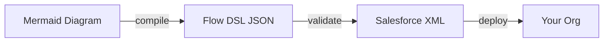
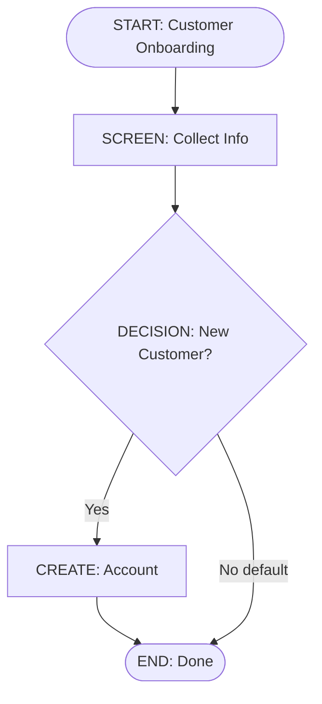
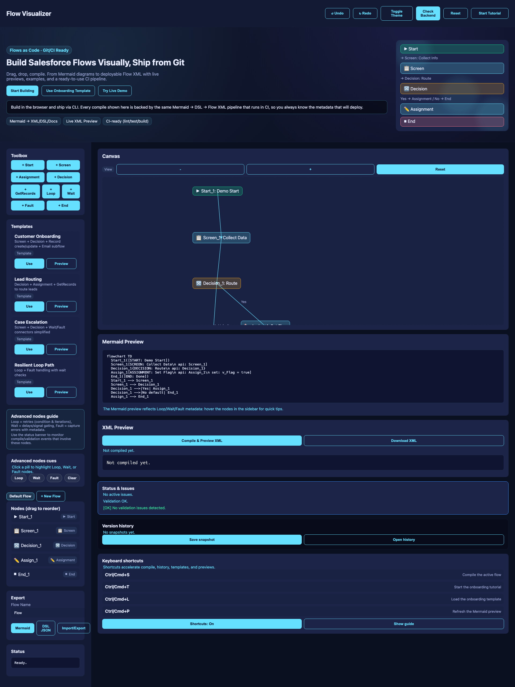
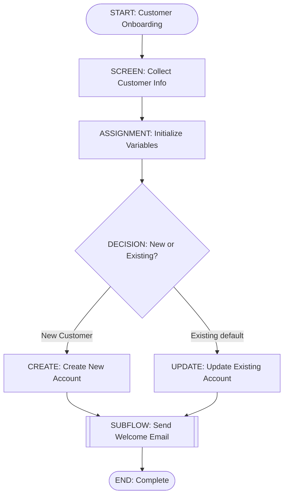

# Mermaid-to-Salesforce Flow Compiler

[](https://github.com/krukmat/Mermaid2SF/actions/workflows/ci.yml)
[](https://codecov.io/gh/krukmat/Mermaid2SF)
[](https://badge.fury.io/js/mermaid-flow-compiler)
[](https://opensource.org/licenses/MIT)

> **Turn Mermaid diagrams into deployable Salesforce Flows** - Version control, CI/CD, and AI-ready workflows for Flow development.

## What is this?

**Mermaid2SF** is a comprehensive toolkit for Salesforce Flow development that bridges the gap between visual flow design and production deployment. It consists of:

1. **CLI Compiler** - Convert Mermaid flowchart diagrams into production-ready Salesforce Flow XML metadata
2. **Web Visualizer** - Interactive drag-and-drop editor with live XML preview and diagram generation
3. **Flow DSL** - Intermediate JSON/YAML representation of Salesforce Flows (version-controllable, AI-friendly)
4. **Validation Engine** - Structural and semantic validation with actionable error messages
5. **Analysis Tools** - Complexity metrics, recommendations, and flow documentation generation

**The Problem:** Salesforce Flows are trapped in the Flow Builder UI—no version control, no code review, no CI/CD, no easy collaboration.

**The Solution:** Write flows as code (Mermaid diagrams), version control them like any other code, integrate with your CI/CD pipeline, and deploy with confidence.

### How it works:


```mermaid
flowchart LR
    A[Mermaid Diagram] -->|compile| B[Flow DSL JSON]
    B -->|validate| C[Salesforce XML]
    C -->|deploy| D[Your Org]
```

**Result:** Git workflows, pull requests, CI/CD, automated testing, and AI-powered analysis for your Flows!

### Who is this for?

- **Salesforce Developers** - Build, test, and deploy flows from the command line
- **Flow Architects** - Design flows visually, review in PRs, collaborate with teams
- **DevOps Engineers** - Automate flow deployment, enforce validation gates, track changes
- **AI/Automation** - Generate flows programmatically, analyze flow patterns, suggest improvements

---

## ⚡ Quick Demo (30 Seconds)

### 1️⃣ You have a diagram:


```mermaid
flowchart TD
    Start([START: Customer Onboarding])
    Screen[SCREEN: Collect Info]
    Decision{DECISION: New Customer?}
    Create[CREATE: Account]
    End([END: Done])

    Start --> Screen --> Decision
    Decision -->|Yes| Create --> End
    Decision -->|No default| End
```

### 2️⃣ Run ONE command:

```bash
npm run cli -- compile --input my-flow.mmd --out-flow ./flows
```

### 3️⃣ Get deployable output:

```bash
✓ Compilation successful
  Flow XML: ./flows/my-flow.flow-meta.xml  ← Deploy to Salesforce!
  DSL JSON: ./flows/my-flow.flow.json     ← Version control!
  Docs: ./flows/my-flow.md                ← Auto documentation!
```

**[Quick Start Guide →](docs/QUICK_START.md)** - Get started in 2 minutes!

---

## Features

- ✅ **Full v1 Element Support**: Start, End, Assignment, Decision, Screen, RecordCreate, RecordUpdate, Subflow
- ✅ **Comprehensive Validation**: Structural + semantic validation with cycle detection
- ✅ **Documentation Generation**: Auto-generate Markdown docs and normalized Mermaid diagrams
- ✅ **Flow Analysis & Explain**: Analyze complexity, generate recommendations, and export reports (text/json/html)
- ✅ **Lint Command**: Validate flows without generating output
- ✅ **Interactive Mode**: Wizard to compile or create flows with live validation
- ✅ **Decompile Command**: Reverse Flow XML into DSL + Mermaid with full metadata preservation (layout, conditionLogic, filterLogic)
- ✅ **MermaidGenerator**: Convert Flow DSL back to Mermaid diagrams with complete metadata fidelity
- ✅ **Round-Trip Validation**: Ensure XML → DSL → Mermaid preserves all flow metadata without loss
- ✅ **Web Visualizer**: Drag/drop editor with live XML preview (syntax highlighting) and zoom/pan
- ✅ **Strict Mode**: Treat warnings as errors for stricter validation
- ✅ **Deterministic Output**: Same input always produces identical output (Git-friendly)
- ✅ **Performance Checked**: 50+ node flows parse/validate/generate in <3s locally
- ✅ **Hosted Frontend Ready**: Static UI can be served from `web/server/index.js` (open `/flow/` if you proxy WordPress on `/`)
- ✅ **Version history**: Save snapshots per flow and restore/compare states through the history modal; the most recent 10 entries stay in localStorage.
- ✅ **Keyboard shortcuts**: Ctrl/Cmd+S compiles, Ctrl/Cmd+T starts the tutorial, Delete removes nodes, arrows nudge, and a shortcut guide can be toggled on/off for accessibility.

---

## 🎨 Web Visualizer (Interactive Editor)

The **Web Visualizer** provides a complete drag-and-drop interface for building and editing Salesforce Flows visually without touching code:



### What You See:

- **Left Sidebar**: Toolbox with quick-add buttons for all flow element types (Start, Screen, Assignment, Decision, GetRecords, Loop, Wait, Fault, End)
- **Central Canvas**: Visual drag-and-drop flow builder with automatic edge rendering and connectors
- **Top Header**: Undo/Redo buttons, theme toggle (dark/light modes), and tutorial launcher
- **Bottom Cards**: Mermaid preview, XML output with syntax highlighting, validation status, and version history

### Key Capabilities:

**Core Editing:**

- ✨ **Drag-and-Drop Toolbox**: Add elements by dragging to canvas or quick-click buttons
- 🔗 **Visual Connectors**: Auto-drawn edges with decision labels (Yes/No for conditions)
- 📋 **Live Mermaid Preview**: Real-time Mermaid diagram rendering as you build
- 🎯 **Type-Aware Elements**: Color-coded nodes (green Start, red End, blue Screen, orange Decision, cyan Assignment)

**Validation & Feedback:**

- 🧪 **Validation UX**: Error/warning cards with remedies and auto-fix buttons; hover to highlight affected nodes
- ✅ **Live Validation**: Real-time messages for structural issues (missing Start, unreachable nodes)
- 📊 **Status Banners**: Floating notifications for compile events, warnings, and backend health

**Productivity Features:**

- ⏪ **Undo/Redo**: Full edit history (up to 20 snapshots) with `Ctrl/Cmd+Z` / `Ctrl/Cmd+Shift+Z` and header buttons
- 💾 **Version History**: Save snapshots and restore previous versions (localStorage-backed)
- ✏️ **Inline Editing**: Double-click nodes to edit inline; right-click context menu for edit/duplicate/delete
- 🧾 **Smart Export**: Flow name input prefixes downloads (Mermaid/DSL/XML) for version control

**Accessibility & Learning:**

- 🎓 **Interactive Tutorial**: Guided onboarding with `Ctrl/Cmd+T` or header button
- 🔍 **Advanced Node Cues**: Highlight Loop/Wait/Fault nodes to understand retry/delay patterns
- 🌓 **Theme Toggle**: Dark and light modes for comfortable editing
- ⌨️ **Keyboard Shortcuts**:
  - `Ctrl/Cmd+S` - Compile
  - `Ctrl/Cmd+Z` / `Ctrl/Cmd+Shift+Z` - Undo/Redo
  - `Ctrl/Cmd+T` - Tutorial
  - `Delete` - Remove node
  - Arrow keys - Nudge position

**Frontend Improvements (Recent Refactor):**

- 🚀 **Modular Component Architecture**: Extracted validation UI, export manager, and state management into reusable modules for maintainability
- 📱 **Responsive Layout**: Improved media queries ensure usable canvas on tablets and mobile (sidebar collapses appropriately)
- 🎨 **Enhanced Theming**: Light/dark mode with CSS variables for consistent styling across 300+ UI elements
- 🧪 **Comprehensive Testing**: 6 test suites (vitest + jsdom) covering export, state, validation, and editor modules

### Try it now:

**Self-hosted (recommended for testing):**

```bash
npm run build
node web/server/index.js
# Open http://localhost:4000
```

**Or see the live demo:**
🌐 **[Open Web Visualizer (iotforce.es)](http://iotforce.es/flow/)** _(may be offline)_

### 🌐 Web Visualizer Deployment

The hosted demo runs on a DigitalOcean droplet using Node 18, `pm2`, and Apache as a reverse proxy. Follow `DEPLOY_STEPS.md` for the exact commands, systemd service, and proxy configuration that keep `/flow/`, `/api/compile`, and `/health` available.

**Why this architecture?**

- Backend validates using the **same pipeline** as the CLI (Mermaid → DSL → XML)
- What you see in the UI **always matches** what deploys to Salesforce
- Perfect for learning, prototyping, and rapid iteration before CI/CD integration

---

## Quick Start

### Installation

```bash
npm install
npm run build
```

### Compile a Flow

```bash
# Compile Mermaid to Salesforce Flow XML
mermaid-flow-compile compile \
  --input examples/v1/complete-flow.mmd \
  --out-flow output/flows \
  --out-json output/dsl \
  --out-docs output/docs

# Or use npm script
npm run cli -- compile --input examples/v1/complete-flow.mmd --out-flow output/flows
```

### Validate a Flow

```bash
# Lint a single file
mermaid-flow-compile lint --input my-flow.mmd

# Lint all flows in a directory
mermaid-flow-compile lint --input flows/

# Strict mode (warnings as errors)
mermaid-flow-compile lint --input my-flow.mmd --strict
```

## 📋 Automatic Test Case Generation

Use `mermaid-flow-compile test-plan` to derive path coverage, sample variable data, and placeholder scripts any time you change a Flow DSL or Mermaid source.

```bash
mermaid-flow-compile test-plan \
  --input output/dsl/complete-flow.flow.json \
  --out artifacts/test-plan \
  --format json
```

- `--input`: accepts `.mmd`, `.json`, `.yaml`, or `.yml`.
- `--out`: writes `<flowApiName>.test-plan.json` plus one script per path (Apex class names) and a checksum.
- `--format json|text`: choose CLI summary format.
- Use `--skip-scripts` to only print the summary, or `--skip-validation` if the DSL is already trusted.

### Analyze a Flow

```bash
# Generate text summary with complexity analysis
mermaid-flow-compile explain --input my-flow.mmd

# Export JSON report for CI/CD integration
mermaid-flow-compile explain --input my-flow.mmd --format json

# Generate HTML report
mermaid-flow-compile explain --input my-flow.mmd --format html > report.html
```

## Commands

### `compile`

Compile Mermaid flowchart to Salesforce Flow metadata.

**Options:**

- `--input <path>` - Path to Mermaid file (required)
- `--out-flow <dir>` - Output directory for Flow XML
- `--out-json <dir>` - Output directory for DSL JSON
- `--out-docs <dir>` - Output directory for documentation
- `--dsl-format <format>` - DSL format: json or yaml (default: json)
- `--strict` - Treat warnings as errors
- `--verbose` - Verbose logging
- `--debug` - Debug logging, stage timings, debug artifacts in `.debug/`
- `--watch` - Watch input file and recompile on changes

**Example:**

```bash
mermaid-flow-compile compile \
  --input my-flow.mmd \
  --out-flow flows/ \
  --out-json dsl/ \
  --out-docs docs/ \
  --strict \
  --verbose \
  --debug \
  --watch
```

### `lint`

Validate Mermaid flowchart without generating output.

**Options:**

- `--input <path>` - Path to Mermaid file or directory (required)
- `--strict` - Treat warnings as errors
- `--verbose` - Verbose logging
- `--debug` - Debug logging and stage timings
- `--watch` - Watch file/directory and re-run lint on changes

**Example:**

```bash
mermaid-flow-compile lint --input flows/ --strict
```

### `explain`

Analyze and summarize Flow structure, complexity, and generate recommendations.

**Options:**

- `--input <path>` - Path to Mermaid (.mmd) or DSL (.json/.yaml/.yml) file (required)
- `--format <format>` - Output format: `text`, `json`, or `html` (default: `text`)
- `--strict` - Treat warnings as errors
- `--verbose` - Verbose logging
- `--debug` - Debug logging and validation timings

**Example:**

```bash
# Text summary (default)
mermaid-flow-compile explain --input my-flow.mmd

# JSON output for programmatic analysis
mermaid-flow-compile explain --input my-flow.mmd --format json

# HTML report
mermaid-flow-compile explain --input my-flow.mmd --format html > report.html

# Interactive wizard (compile existing or create new)
mermaid-flow-compile interactive
```

**Output includes:**

- Flow metadata (API name, label, process type)
- Element counts by type (Screens, Assignments, Decisions, etc.)
- Cyclomatic complexity metric
- Decision outcomes count
- Variables count
- Validation errors and warnings
- **Recommendations** for improving flow quality:
  - Complexity reduction suggestions
  - Variable declaration reminders
  - Validation issue resolution tips

**Example output (text format):**

```
Flow: Customer Onboarding (CustomerOnboarding)
Process: Autolaunched | API: 60.0
Start: Start_1 | Ends: End_Success, End_Failure
Elements: 12 (Screens 2, Decisions 3, Assignments 2, RC 1, RU 1, Subflows 1)
Outcomes: 8 | Variables: 5 | Cyclomatic: 4
Validation: 0 errors, 2 warnings
Warnings:
  - UNREACHABLE_ELEMENT: Element 'Update_Optional' is not reachable from Start
Recommendations:
  - Resolve validation warnings before deployment.
```

### `interactive`

Run an interactive wizard to compile existing Mermaid files or create a new flow skeleton with validation and ASCII preview.

**Options:**

- No flags required; prompts guide file selection and optional generation of XML/DSL/Docs.

**Example:**

```bash
mermaid-flow-compile interactive
```

### `decompile`

Reverse a Flow XML (`*.flow-meta.xml`) into DSL JSON and Mermaid diagram with full metadata preservation.

**Metadata Extraction:**
- ✅ Layout coordinates (locationX, locationY) for all elements
- ✅ Decision conditionLogic ('and'/'or')
- ✅ RecordUpdate filterLogic ('and'/'or')
- ✅ All element types (Start, Assignment, Decision, Screen, RecordCreate, RecordUpdate, Subflow, Loop, Wait, GetRecords, Fault)

**Options:**

- `--input <path>` - Path to Flow XML (required)
- `--out-json <dir>` - Output directory for DSL JSON
- `--out-mermaid <dir>` - Output directory for Mermaid

**Example:**

```bash
mermaid-flow-compile decompile \
  --input force-app/main/default/flows/MyFlow.flow-meta.xml \
  --out-json .generated/flows \
  --out-mermaid docs/flows
```

**Output:**
- DSL JSON with complete metadata (layout, conditionLogic, filterLogic)
- Mermaid diagram with metadata annotations
- Ready for version control, diffing, and round-trip compilation

## End-to-end example

```bash
# Build
npm run build

# Compile a sample Mermaid to XML/DSL/docs
node dist/cli/index.js compile \
  --input examples/v1/complete-flow.mmd \
  --out-flow output/flows \
  --out-json output/dsl \
  --out-docs output/docs

# Decompile the generated XML back to DSL/Mermaid
node dist/cli/index.js decompile \
  --input output/flows/complete-flow.flow-meta.xml \
  --out-json output/dsl \
  --out-mermaid output/docs
```

Artifacts:

- Flow XML: `output/flows/complete-flow.flow-meta.xml`
- DSL JSON: `output/dsl/complete-flow.flow.json`
- Mermaid: `output/docs/complete-flow.mmd` (open in https://mermaid.live or VS Code)
- Markdown summary: `output/docs/complete-flow.md`

### Round-Trip Metadata Preservation

The decompile process preserves all flow metadata through the reverse transformation:

```
Original XML (with layout, conditionLogic, filterLogic)
    ↓ parseFlowXmlText()
Flow DSL (metadata preserved)
    ↓ MermaidGenerator.generate()
Mermaid Diagram (metadata included as annotations)
```

**What's preserved:**
- Layout coordinates for all elements (displayed as `layout: pos: x,y`)
- Decision conditionLogic ('and'/'or' logic for multiple conditions)
- RecordUpdate filterLogic ('and'/'or' for filter combinations)
- All element connections and labels

This enables true **bidirectional workflows**: design in Flow Builder, export to XML, decompile to Mermaid for version control, then recompile back to XML without losing any metadata.

## API / OpenAPI

- Local API server: `node web/server/index.js` (defaults to port 4000) with `/health` and `/api/compile`.
- OpenAPI spec: `docs/openapi.yaml` (references `schemas/flow-dsl.schema.json` for DSL payloads).
- Validate the spec: `npm run openapi:validate`.
- CI/CD guide: see `docs/CI_CD_GUIDE.md` for GH Actions and Husky instructions.

-### Web visualizer

- Serve the static UI directly from the Node server (included): start `node web/server/index.js` and open `http://<host>/flow/` if you proxy WordPress on `/` (adjust Apache/Nginx ProxyPass accordingly), or `/` if Node serves the root.
- Online demo: [http://iotforce.es/flow/](http://iotforce.es/flow/) (same UI backed by the live API).
- Backend endpoints: `/health` and `/api/compile` (used by the UI). Frontend uses `window.location.origin` as base URL.

## View the result without running commands

Pre-generated outputs live under `examples/output/` so visitors can inspect the full pipeline without compiling locally:

- Mermaid: [examples/output/complete-flow.mmd](examples/output/complete-flow.mmd)
- Flow XML: [examples/output/complete-flow.flow-meta.xml](examples/output/complete-flow.flow-meta.xml)
- DSL JSON: [examples/output/complete-flow.flow.json](examples/output/complete-flow.flow.json)
  Input source diagram lives at [examples/v1/complete-flow.mmd](examples/v1/complete-flow.mmd).

Open the Mermaid file in https://mermaid.live, skim the XML in an editor, or diff the DSL/mermaid/XML pair to see the deterministic round-trip.

## Frontend Testing

The UI helpers under `web/frontend/modules/` now ship with a Vitest/`jsdom` harness (`vitest.config.js` + `web/frontend/__tests__/setup.js`). Run `npm run test:web` to exercise the helper modules and the new canvas renderer helpers, or `npm run test:web:watch` while you iterate locally.

## Supported Flow Elements

| Element Type | Mermaid Shape | Prefix        | Description               |
| ------------ | ------------- | ------------- | ------------------------- |
| Start        | `([...])`     | `START:`      | Flow entry point          |
| End          | `([...])`     | `END:`        | Flow termination          |
| Assignment   | `[...]`       | `ASSIGNMENT:` | Set variable values       |
| Decision     | `{...}`       | `DECISION:`   | Conditional branching     |
| Screen       | `[...]`       | `SCREEN:`     | Display UI to users       |
| RecordCreate | `[...]`       | `CREATE:`     | Create Salesforce records |
| RecordUpdate | `[...]`       | `UPDATE:`     | Update Salesforce records |
| Subflow      | `[[...]]`     | `SUBFLOW:`    | Invoke another flow       |

GetRecords supports filters, field selection, and optional sorting:

```
GET: Accounts
 api: Get_Accounts
 object: Account
 field: Id
 filter: Name = 'Test'
 sort: Name desc
```

## Example Mermaid Flow


```mermaid
flowchart TD
    Start([START: Customer Onboarding])
    Screen[SCREEN: Collect Customer Info]
    Assign[ASSIGNMENT: Initialize Variables]
    Decision{DECISION: New or Existing?}
    Create[CREATE: Create New Account]
    Update[UPDATE: Update Existing Account]
    Notify[[SUBFLOW: Send Welcome Email]]
    End([END: Complete])

    Start --> Screen
    Screen --> Assign
    Assign --> Decision
    Decision -->|New Customer| Create
    Decision -->|Existing default| Update
    Create --> Notify
    Update --> Notify
    Notify --> End
```

See `docs/MERMAID_CONVENTIONS.md` for complete syntax guide.

## Validation Features

### Structural Validation

- Exactly one Start element
- At least one End element
- Valid element references
- Decision outcomes (must have one default)

### Semantic Validation (v1 Usable)

- Variable reference checking
- Undefined variable warnings
- Cycle detection (infinite loops)
- Reachability analysis

### Strict Mode

Use `--strict` flag to treat warnings as errors:

```bash
mermaid-flow-compile compile --input flow.mmd --out-flow flows/ --strict
```

## VSCode Integration

The project includes JSON Schema integration for VSCode, providing autocomplete and validation for `.flow.json` files.

**Features:**

- ✅ Autocomplete for all Flow DSL properties
- ✅ Real-time validation with inline errors
- ✅ Hover documentation for fields
- ✅ Type checking for all element types

**Setup:**
The schema is automatically configured in `.vscode/settings.json`. When you open a `.flow.json` file in VSCode, you'll get full IntelliSense support.

**Usage:**

1. Create or open a `.flow.json` file
2. Start typing - VSCode will suggest valid properties
3. Hover over properties to see documentation
4. Validation errors appear as you type

## Development

### Scripts

```bash
npm run build     # Compile TypeScript
npm run dev       # Watch mode
npm test          # Run tests
npm run lint      # ESLint
npm run format    # Prettier
```

### Project Structure

```
src/
├── cli/
│   ├── index.ts           # CLI entry point
│   └── commands/
│       ├── compile.ts     # Compile command
│       ├── lint.ts        # Lint command
│       └── explain.ts     # Explain/analyze command
├── parser/                # Mermaid parser
├── extractor/             # Metadata extraction
├── dsl/                   # Intermediate model builder
├── validator/             # Flow validation (structural + semantic)
├── generators/
│   ├── flow-xml-generator.ts    # Salesforce Flow XML
│   └── docs-generator.ts        # Markdown + Mermaid docs
├── types/                 # TypeScript type definitions
└── utils/                 # Utility functions

examples/
├── poc/                   # Phase 1 examples
└── v1/                    # v1 Usable examples

docs/
├── ARCHITECTURE.md        # System architecture
├── MERMAID_CONVENTIONS.md # Mermaid syntax guide
└── PROJECT_PLAN.md        # Full project roadmap
```

## Test Coverage

```bash
npm test
```

Current coverage:

- **95 tests passing (100%)**
- **Integration Tests**: 24 tests (end-to-end pipeline for all v1 elements)
  - Complete flow with all 8 element types
  - Individual element type tests (Screen, RecordCreate, RecordUpdate, Subflow, Assignment, Decision)
  - Validation error detection
  - Deterministic output verification
  - Real-world example files (5 examples)
  - Documentation generation
- **Reverse Engineering (F5)**: 37 tests (XML → DSL → Mermaid with metadata preservation)
  - XML Parser: 16 tests (layout, conditionLogic, filterLogic extraction)
  - MermaidGenerator: 12 tests (DSL → Mermaid conversion with all metadata)
  - Round-Trip Validation: 9 tests (structural integrity, metadata fidelity)
- **Validator**: 16 tests (structural + semantic validation)
- **DocsGenerator**: 7 tests (Markdown + Mermaid generation)
- **Flow XML Generator**: 3 tests (XML generation, YAML export)
- **Parser**: 8 tests (edge parsing, node shapes, deterministic ordering)

## Exit Codes

- `0` - Success
- `1` - Validation errors (or warnings in strict mode)
- `2` - Internal errors (parsing, file I/O, etc.)

## Phase Status

### ✅ Phase 1 - PoC (Complete)

- Basic element types (Start, End, Assignment, Decision)
- Mermaid parser
- Metadata extraction
- DSL builder
- XML generation
- Structural validation
- CLI foundation

### ✅ Phase 2 - v1 Usable (Complete)

- Extended element types (Screen, RecordCreate, RecordUpdate, Subflow)
- Enhanced semantic validation
- DocsGenerator (Markdown + normalized Mermaid)
- Lint command
- Strict mode
- Comprehensive examples
- Documentation

### ✅ Phase 3 - Advanced DX (Complete)

- Reverse engineering (`decompile`) and round-trip tests
- Explain/analyze reports (text/json/html)
- Interactive CLI wizard
- Performance instrumentation and watch mode

### ✅ Phase 4 - Extensions (Complete)

- Advanced elements: Loop, Wait, GetRecords, Fault paths
- Web visualizer/editor with live XML preview
- Reverse XML parser to DSL/Mermaid with metadata preservation
- YAML DSL export
- Deployment hosting is deferred

### ✅ Phase F5 - Reverse Engineering (Complete)

- **XML Layout Parsing**: Extract locationX/locationY from all element types
- **Decision conditionLogic**: Parse and preserve logic type ('and'/'or')
- **RecordUpdate filterLogic**: Extract filter combination strategy
- **MermaidGenerator**: Convert DSL to Mermaid flowcharts with metadata
- **Round-Trip Validation**: Pragmatic structural integrity tests (37 tests passing)
- **Metadata Fidelity**: Zero-loss transformation through XML → DSL → Mermaid

See `PROJECT_PLAN.md` for complete roadmap.

## 📚 Documentation & Resources

### **Getting Started:**

- 🚀 **[Quick Start Guide](docs/QUICK_START.md)** - From zero to working Flow in 2 minutes (start here!)
- 🏗️ **[Architecture Document](mermaid-flow-compiler-architecture.md)** - System design and spec
- 📝 **[CLAUDE.md](CLAUDE.md)** - Development guidelines and codebase overview

### **Technical Reference:**

- 📐 **[Mermaid Conventions](docs/MERMAID_CONVENTIONS.md)** - Mermaid syntax guide for Flow diagrams
- ✅ **[Validation Rules](docs/FLOW_VALIDATION_RULES.md)** - Complete list of validation constraints
- 🏛️ **[Validation Architecture](docs/FLOW_VALIDATION_ARCHITECTURE.md)** - How validation is implemented
- 🔄 **[CI/CD Integration](docs/CI_CD_GUIDE.md)** - Set up automated validation and deployment

### **Articles & Resources:**

- 📄 **[Medium Article: Flows as Code](docs/MEDIUM_POST.md)** - Introduction to the project and philosophy
- 📋 **[Project Plan](PROJECT_PLAN.md)** - Roadmap and task tracking

### **Quick Commands:**

- ⚡ `npm run cli -- interactive` - Try interactive mode wizard
- 📊 `npm run cli -- explain --input examples/v1/complete-flow.mmd` - Analyze a flow
- ✅ `npm run cli -- lint --input examples/v1/` - Validate flows
- 🔄 `npm run cli -- compile --input my-flow.mmd --watch` - Watch mode

---

## 🌟 What Makes This Special?

### **For Solo Developers:**

- ✅ **Git-based workflow** - Version control your Flows like any other code
- ✅ **Local development** - Edit in VS Code with Mermaid preview
- ✅ **Fast iteration** - Watch mode for instant feedback

### **For Teams:**

- ✅ **Code reviews** - Pull requests with clear diffs in DSL JSON
- ✅ **Collaboration** - Multiple developers on same Flow without conflicts
- ✅ **Documentation** - Always up-to-date, auto-generated docs

### **For DevOps:**

- ✅ **CI/CD ready** - Automated validation, testing, deployment
- ✅ **Quality gates** - Strict mode prevents bad Flows
- ✅ **Performance** - Sub-second compilation for rapid pipelines

### **For AI/Automation:**

- ✅ **AI-friendly DSL** - ChatGPT/Claude can read, analyze, and suggest improvements
- ✅ **Programmatic** - Generate Flows from requirements automatically
- ✅ **Analyzable** - Complexity metrics, recommendations, pattern detection

---

## Contributing

See `CLAUDE.md` for development guidelines and codebase overview.

## License

MIT
