# Mermaid2SF

[](https://github.com/krukmat/Mermaid2SF/actions/workflows/ci.yml)
[](LICENSE)

> **Salesforce Flow-as-Code with Mermaid as the human-friendly visual layer.**

Mermaid2SF is a bidirectional compiler experiment for Salesforce Flow. It turns a constrained Mermaid diagram into a canonical Flow model, validates Salesforce semantics, generates Flow metadata, and can reverse supported Salesforce XML back into Mermaid.

The core contract is:

```text
Salesforce Flow XML ⇄ FlowIR v2 ⇄ Mermaid
```

**FlowIR v2 is the semantic source of truth.** Mermaid is the human-readable authoring/review format; Salesforce XML is the platform adapter.

> [!IMPORTANT]
> Mermaid2SF is a correctness-hardened **PoC with a documented guaranteed subset**, not a universal Salesforce Flow compiler. Exact fidelity boundaries are defined in [SUPPORTED_FEATURES.md](SUPPORTED_FEATURES.md).

## What is already working

The compiler now has bidirectional, semantically tested coverage for the most representative Salesforce Flow execution models:

| Flow family | Guaranteed subset |
|---|---|
| Autolaunched | variables, assignments, decisions, Get/Create/Update Records, basic Subflow |
| Record-Triggered After Save | Create / Update / CreateAndUpdate + supported business elements |
| Record-Triggered Before Save | Fast Field Updates with Salesforce-specific restrictions |
| Record-Triggered Before Delete | Delete trigger + supported background operations |
| Schedule-Triggered | Once / Daily / Weekly with optional record context |
| Platform Event-Triggered | event payload through <code>$Record</code> |
| Screen Flow | standard inputs, Display Text, navigation, defaults, static choices, simple visibility |

Every guaranteed family has semantic round-trip tests, a canonical Salesforce fixture, and an authenticated Metadata API dry-run gate.

For the consolidated implementation history, see [Project Compilation](docs/PROJECT_COMPILATION.md).

## How the compiler works

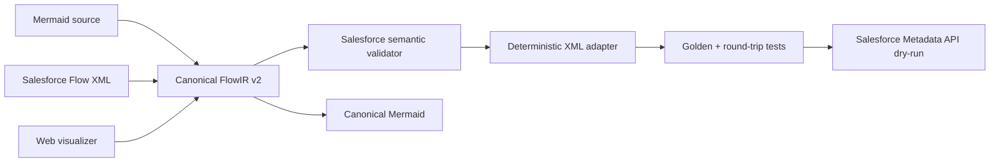
```mermaid
flowchart LR
    M[Mermaid source] --> IR[Canonical FlowIR v2]
    SF[Salesforce Flow XML] --> IR
    UI[Web visualizer] --> IR

    IR --> V[Salesforce semantic validator]
    V --> X[Deterministic XML adapter]
    X --> G[Golden + round-trip tests]
    G --> O[Salesforce Metadata API dry-run]

    IR --> MM[Canonical Mermaid]
```

The important distinction is that Mermaid2SF does not treat Flow XML as arbitrary text generation. Supported metadata is normalized into FlowIR, validated, and only then serialized.

---

# Visual tour

The examples below are intentionally small. Each demonstrates a different Salesforce execution model while using the same compiler pipeline.

The executable source files live under [examples/tour/](examples/tour/), and CI compiles them through the canonical FlowIR path so the README examples cannot silently drift away from the implementation.

## 1. Autolaunched — reusable business logic

A reusable Flow receives data, evaluates it, and performs work without depending on a record trigger or UI.

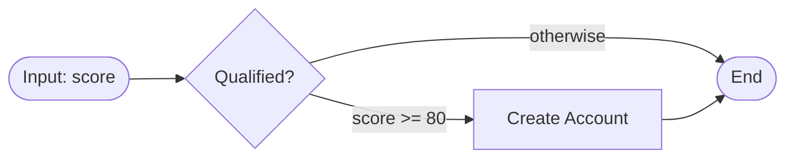
```mermaid
flowchart LR
    S([Input: score]) --> D{Qualified?}
    D -->|score >= 80| C[Create Account]
    D -->|otherwise| E([End])
    C --> E
```

This maps naturally to a Mermaid2SF Flow with an explicit input variable and a structured Decision.

<details>
<summary>Compiler source</summary>

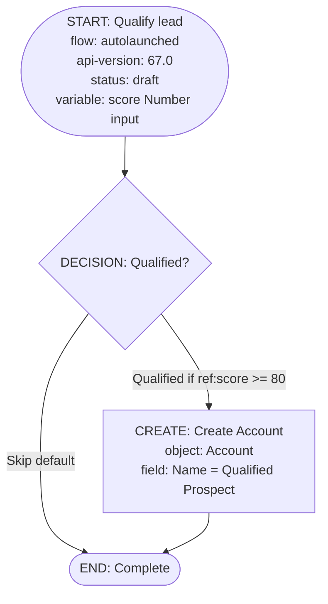
```mermaid
flowchart TD
    Start([START: Qualify lead\nflow: autolaunched\napi-version: 67.0\nstatus: draft\nvariable: score Number input])
    Check{DECISION: Qualified?}
    Create[CREATE: Create Account\nobject: Account\nfield: Name = Qualified Prospect]
    End([END: Complete])

    Start --> Check
    Check -->|Qualified if ref:score >= 80| Create
    Check -->|Skip default| End
    Create --> End
```

Source: [01-autolaunched-qualification.mmd](examples/tour/01-autolaunched-qualification.mmd)

</details>

## 2. Record-Triggered — react at the correct transaction point

Mermaid2SF models the three important record-triggered contracts separately because they have different Salesforce semantics.

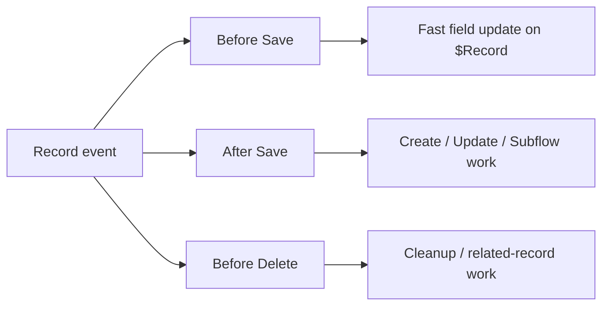
```mermaid
flowchart LR
    R[Record event] --> B[Before Save]
    R --> A[After Save]
    R --> D[Before Delete]

    B --> BF[Fast field update on $Record]
    A --> AF[Create / Update / Subflow work]
    D --> DF[Cleanup / related-record work]
```

A typical **Before Save** Flow can normalize the triggering record without extra DML:

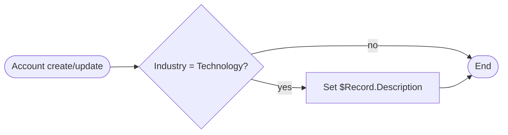
```mermaid
flowchart LR
    S([Account create/update]) --> F{Industry = Technology?}
    F -->|yes| N[Set $Record.Description]
    F -->|no| E([End])
    N --> E
```

<details>
<summary>Compiler source</summary>

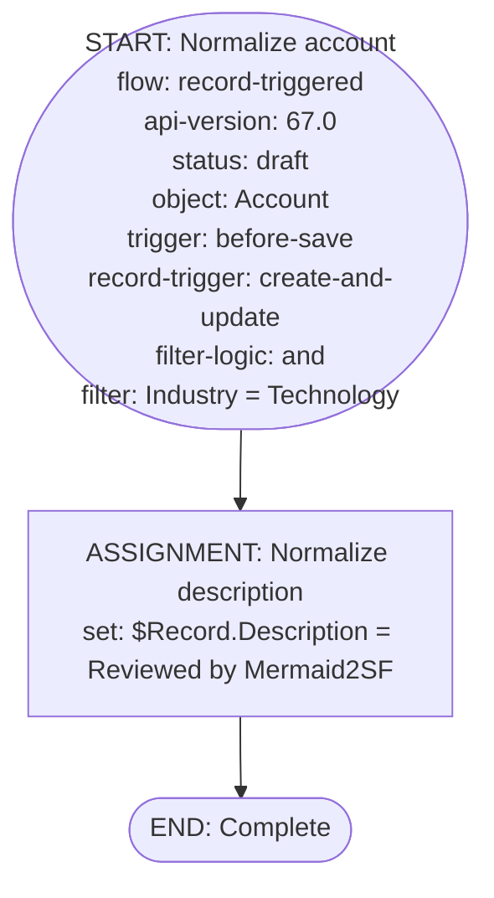
```mermaid
flowchart TD
    Start([START: Normalize account\nflow: record-triggered\napi-version: 67.0\nstatus: draft\nobject: Account\ntrigger: before-save\nrecord-trigger: create-and-update\nfilter-logic: and\nfilter: Industry = Technology])
    Normalize[ASSIGNMENT: Normalize description\nset: $Record.Description = Reviewed by Mermaid2SF]
    End([END: Complete])

    Start --> Normalize --> End
```

Source: [02-record-before-save.mmd](examples/tour/02-record-before-save.mmd)

</details>

The same family also has guaranteed subsets for **After Save** and **Before Delete**; their exact restrictions are documented in [SUPPORTED_FEATURES.md](SUPPORTED_FEATURES.md).

## 3. Schedule-Triggered — recurring background maintenance

A schedule becomes Start metadata rather than an ad-hoc timer embedded in the graph.

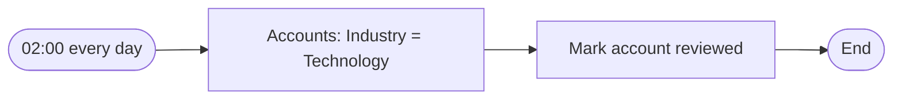
```mermaid
flowchart LR
    T([02:00 every day]) --> Q[Accounts: Industry = Technology]
    Q --> U[Mark account reviewed]
    U --> E([End])
```

<details>
<summary>Compiler source</summary>

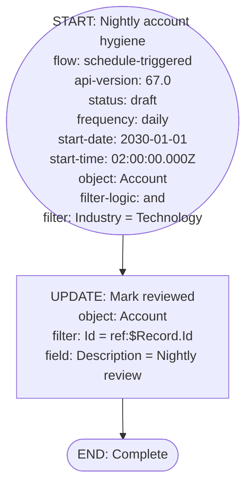
```mermaid
flowchart TD
    Start([START: Nightly account hygiene\nflow: schedule-triggered\napi-version: 67.0\nstatus: draft\nfrequency: daily\nstart-date: 2030-01-01\nstart-time: 02:00:00.000Z\nobject: Account\nfilter-logic: and\nfilter: Industry = Technology])
    Update[UPDATE: Mark reviewed\nobject: Account\nfilter: Id = ref:$Record.Id\nfield: Description = Nightly review]
    End([END: Complete])

    Start --> Update --> End
```

Source: [03-scheduled-maintenance.mmd](examples/tour/03-scheduled-maintenance.mmd)

</details>

Supported schedule frequencies in the guaranteed subset are **Once, Daily and Weekly**.

## 4. Platform Event — event-driven integration

A Platform Event payload is represented as the Flow's <code>$Record</code> context.

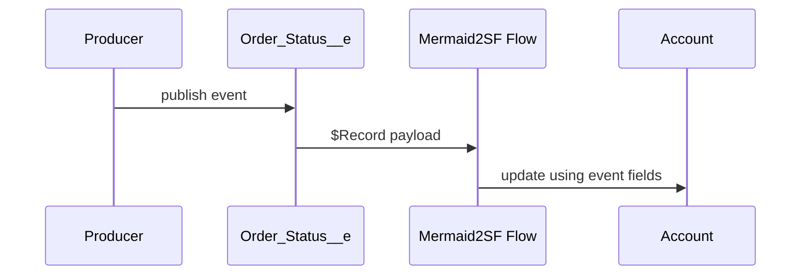
```mermaid
sequenceDiagram
    participant Producer
    participant PE as Order_Status__e
    participant Flow as Mermaid2SF Flow
    participant Account

    Producer->>PE: publish event
    PE->>Flow: $Record payload
    Flow->>Account: update using event fields
```

<details>
<summary>Compiler source</summary>

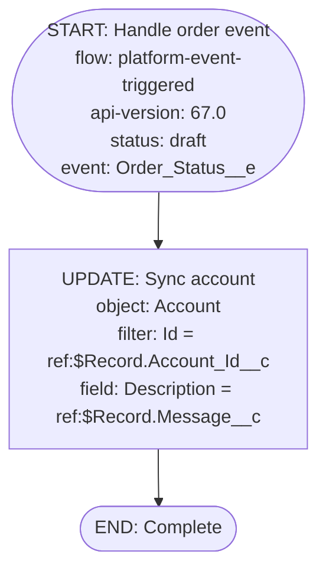
```mermaid
flowchart TD
    Start([START: Handle order event\nflow: platform-event-triggered\napi-version: 67.0\nstatus: draft\nevent: Order_Status__e])
    Update[UPDATE: Sync account\nobject: Account\nfilter: Id = ref:$Record.Account_Id__c\nfield: Description = ref:$Record.Message__c]
    End([END: Complete])

    Start --> Update --> End
```

Source: [04-platform-event-sync.mmd](examples/tour/04-platform-event-sync.mmd)

</details>

Offline validation checks the Flow semantics and event API-name shape; Salesforce remains the authority for whether a particular event and payload schema exist in the target org.

## 5. Screen Flow — human interaction as source

Screen metadata is represented in FlowIR rather than being flattened into visual-only labels.

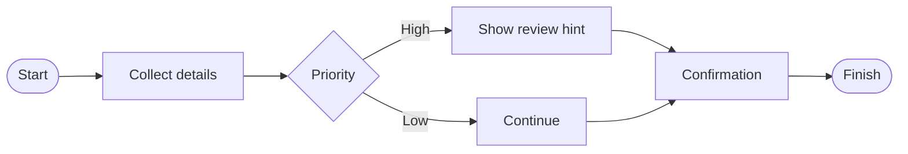
```mermaid
flowchart LR
    S([Start]) --> C[Collect details]
    C --> P{Priority}
    P -->|High| H[Show review hint]
    P -->|Low| N[Continue]
    H --> F[Confirmation]
    N --> F
    F --> E([Finish])
```

The Wave 6 contract preserves standard typed inputs, static choices, Display Text, navigation, defaults and one-condition visibility.

<details>
<summary>Compiler source</summary>

```mermaid
flowchart TD
    Start([START: Guided intake\nflow: screen\napi-version: 67.0\nstatus: draft\nchoice: HighPriority #40;String#41; = High | High Priority\nchoice: LowPriority #40;String#41; = Low | Low Priority])
    Collect[SCREEN: Collect details\nallow-back: true\nallow-finish: true\nallow-pause: false\nshow-footer: true\nshow-header: true\ninput: CustomerName #40;String#41; #91;InputField#93; | Customer Name\nrequired: true\ninput: Priority #40;String#41; #91;DropdownBox#93; | Priority\nchoices: HighPriority,LowPriority\nrequired: true\ndisplay: Hint | High priority requests are reviewed first.\nvisible-if: ref:Priority = High]
    Confirm[SCREEN: Confirm\nallow-back: true\nallow-finish: true\nallow-pause: false\nshow-footer: true\nshow-header: true\ndisplay: Message | Request captured.]
    End([END: Complete])

    Start --> Collect --> Confirm --> End
```

Source: [05-screen-intake.mmd](examples/tour/05-screen-intake.mmd)

</details>

---

## The round-trip guarantee

For a guaranteed feature, success means more than "the XML parser did not crash".

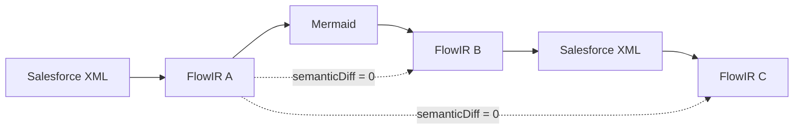
```mermaid
flowchart LR
    A[Salesforce XML] --> B[FlowIR A]
    B --> C[Mermaid]
    C --> D[FlowIR B]
    D --> E[Salesforce XML]
    E --> F[FlowIR C]

    B -. semanticDiff = 0 .-> D
    B -. semanticDiff = 0 .-> F
```

Formatting, irrelevant XML ordering, and the synthetic authoring <code>End</code> representation are normalized. The comparison is semantic rather than byte-for-byte.

## Quick start

Requirements: Node.js 20+.

```bash
npm install
npm run build

npm run cli -- compile \
  --input examples/tour/01-autolaunched-qualification.mmd \
  --out-flow output/flows \
  --out-json output/dsl
```

Flow family, trigger configuration, API version and status belong in the **START metadata** of the Mermaid source. They are not separate <code>--flow-kind</code> CLI switches.

Useful commands:

```bash
# Validate authoring semantics
npm run cli -- lint --input examples/tour/01-autolaunched-qualification.mmd

# Explain a Flow
npm run cli -- explain --input examples/tour/01-autolaunched-qualification.mmd

# Reverse Salesforce XML
npm run cli -- decompile --input force-app/main/default/flows/MyFlow.flow-meta.xml

# Run tests
npm test

# TypeScript build
npm run build
```

## Authoring model

A Flow starts with an explicit execution contract:

```text
START: Normalize account
flow: record-triggered
api-version: 67.0
status: draft
object: Account
trigger: before-save
record-trigger: create-and-update
filter: Industry = Technology
```

Business elements carry the Salesforce metadata required to make them meaningful:

```text
ASSIGNMENT: Normalize description
set: $Record.Description = Reviewed by Mermaid2SF
```

```text
UPDATE: Mark reviewed
object: Account
filter: Id = ref:$Record.Id
field: Description = Nightly review
```

References use the canonical <code>ref:&lt;resource&gt;</code> form when ambiguity matters.

## Validation model

Compilation is gated in layers:

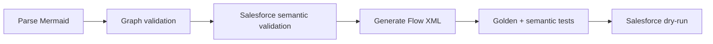
```mermaid
flowchart LR
    P[Parse Mermaid] --> G[Graph validation]
    G --> S[Salesforce semantic validation]
    S --> X[Generate Flow XML]
    X --> T[Golden + semantic tests]
    T --> O[Salesforce dry-run]
```

Validation covers:

- required Flow family / trigger metadata,
- API names and references,
- structured Decision conditions,
- Salesforce-specific Before Save / Before Delete constraints,
- Screen component constraints,
- family-specific <code>$Record</code> semantics,
- deterministic XML generation.

Stable Salesforce diagnostics use the <code>M2SF-SF-*</code> namespace so CI and agents can react deterministically.

## Reverse engineering

<code>decompile</code> uses an XML-tree adapter rather than regex-based XML extraction.

For the documented subset:

```text
Salesforce XML
   ↓
FlowIR
   ↓
canonical Mermaid
```

This makes the same semantic representation available to humans, source control, documentation tooling and agents.

## Web visualizer

The repository also includes a local visualizer with Mermaid/XML previews.

```bash
npm run build
node web/server/index.js
# http://localhost:4000
```


The UI is an authoring/view surface; compiler correctness still lives in FlowIR, validation and the Salesforce adapter.

## Proof and documentation

Start here depending on what you need:

- [Project compilation](docs/PROJECT_COMPILATION.md) — consolidated view of what was built and why.
- [Supported features](SUPPORTED_FEATURES.md) — exact fidelity contract and boundaries.
- [Project plan](PROJECT_PLAN.md) — milestone state and residual debt.
- [Wave 1 proof](docs/WAVE1_AUTOLAUNCHED_PROOF.md)
- [Wave 2A proof](docs/WAVE2A_RECORD_TRIGGERED_AFTER_SAVE_PROOF.md)
- [Wave 2B proof](docs/WAVE2B_RECORD_TRIGGERED_BEFORE_SAVE_PROOF.md)
- [Wave 3 proof](docs/WAVE3_SCHEDULE_TRIGGERED_PROOF.md)
- [Wave 4 proof](docs/WAVE4_RECORD_TRIGGERED_BEFORE_DELETE_PROOF.md)
- [Wave 5 proof](docs/WAVE5_PLATFORM_EVENT_TRIGGERED_PROOF.md)
- [Wave 6 proof](docs/WAVE6_SCREEN_FLOW_PROOF.md)

## Current boundaries

The following remain outside the guaranteed round-trip contract:

- Loop, Wait and Fault-path fidelity,
- Apex Actions,
- HTTP Callouts,
- Orchestration,
- advanced Screen components and responsive layout,
- Dynamic / Record Choice Sets,
- multi-condition Screen visibility,
- metadata not represented by the documented FlowIR subset.

Unsupported metadata is not described as lossless simply because part of it can be parsed.

## Project structure

```text
src/
├── parser/       Mermaid parsing
├── extractor/    authoring metadata extraction
├── dsl/          FlowIR construction
├── types/        canonical FlowIR / typed values
├── validator/    graph + Salesforce semantic validation
├── generators/   Salesforce XML / Mermaid / docs
├── reverse/      Salesforce XML import
├── cli/          compile / decompile / lint / explain
└── utils/        semantic comparison and shared helpers

examples/
├── tour/         README examples, compiler-checked
├── v1/           legacy/example authoring flows
└── salesforce-canonical/

test/
├── fixtures/                  rich semantic fixtures
└── salesforce-project/        org-safe Salesforce validation fixtures
```

## Contributing

Read [AGENTS.md](AGENTS.md) and [CLAUDE.md](CLAUDE.md) before changing compiler semantics.

A new Salesforce feature should traverse the complete contract:

```text
Authoring / import
      → FlowIR
      → semantic validation
      → Salesforce adapter
      → golden / round-trip tests
      → authenticated org gate when deploy compatibility is claimed
```

## License

MIT — see [LICENSE](LICENSE).
