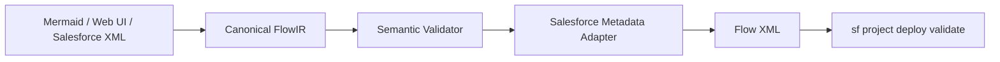
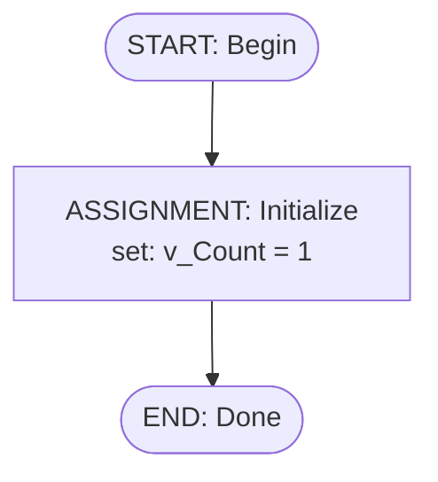
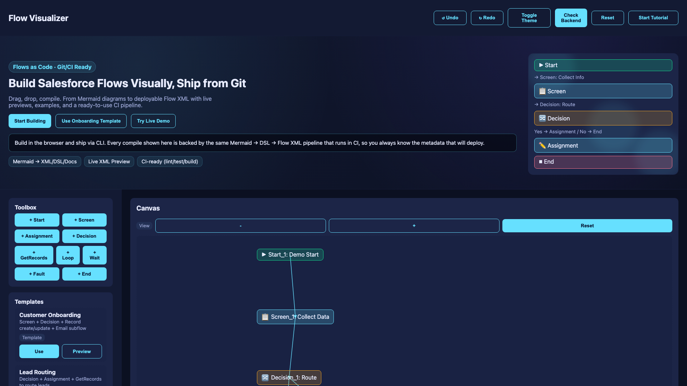

# Mermaid2SF

[](https://github.com/krukmat/Mermaid2SF/actions/workflows/ci.yml)
[](LICENSE)

> **Salesforce Flow-as-Code with Mermaid as the human-friendly authoring layer.**

Mermaid2SF turns a constrained Mermaid flowchart into a canonical Flow model, validates Salesforce semantics, and generates Salesforce Flow metadata. It also supports visual editing, documentation, analysis, and reverse import for an explicitly documented subset.

> [!IMPORTANT]
> Mermaid2SF is a **demo/PoC evolving toward a Salesforce-correct compiler core**. A local `Compilation successful` message means the supported internal validation passed; it does **not** replace a real Salesforce deployment validation. See [SUPPORTED_FEATURES.md](SUPPORTED_FEATURES.md) for the exact fidelity contract.

## Why this project exists

Salesforce Flow is excellent for runtime automation but awkward to review and version as source. Mermaid2SF experiments with a compiler-style workflow:


```mermaid
flowchart LR
    A[Mermaid / Web UI / Salesforce XML] --> B[Canonical FlowIR]
    B --> C[Semantic Validator]
    C --> D[Salesforce Metadata Adapter]
    D --> E[Flow XML]
    E --> F[sf project deploy validate]
```

The architectural rule is simple: **FlowIR is the source of truth**. Mermaid is an authoring/view format; Salesforce XML is an import/export adapter.

## Current focus

The current hardening cycle prioritizes correctness over breadth:

1. Salesforce-correct Flow type and Start metadata mapping.
2. Terminal/End semantics without dangling connectors.
3. Typed values and structured decision conditions.
4. Salesforce semantic validation with stable error codes.
5. Canonical/golden metadata tests and semantic round-trip checks.
6. A real Salesforce deployment validation gate when org credentials are available.
7. Reverse parsing with feature-scoped fidelity instead of blanket lossless claims.

Execution details live in [docs/planning/compiler-correctness-execution.md](docs/planning/compiler-correctness-execution.md).

## Quick start

```bash
npm install
npm run build

npm run cli -- compile \
  --input examples/v1/complete-flow.mmd \
  --out-flow output/flows \
  --out-json output/dsl
```

Useful commands:

```bash
npm run cli -- lint --input examples/v1/
npm run cli -- explain --input examples/v1/complete-flow.mmd
npm run cli -- decompile --input force-app/main/default/flows/MyFlow.flow-meta.xml
npm run ci
```

### Flow kind and API version

The compiler supports an explicit Flow kind/API version at the CLI boundary. When omitted, Screen elements cause Screen Flow inference and otherwise the compiler defaults to Autolaunched.

```bash
npm run cli -- compile \
  --input flow.mmd \
  --flow-kind Screen \
  --api-version 67.0 \
  --out-flow output/flows
```

Record-triggered compilation additionally requires trigger metadata; see `--help` and the examples under `examples/salesforce-fixtures/`.

## Mermaid authoring conventions

A minimal linear flow:


```mermaid
flowchart TD
    Start([START: Begin])
    Assign["ASSIGNMENT: Initialize\nset: v_Count = 1"]
    End([END: Done])
    Start --> Assign --> End
```

Decision paths must carry real semantics, not only labels. The supported authoring convention is:

```mermaid
Decision -->|New customer [when: {!isNew} = true]| Create
Decision -->|Existing default| Update
```

Record operations must declare their Salesforce object:

```text
CREATE: Create Account
object: Account
field: Name = {!accountName}
```

Subflows must declare the child Flow API name:

```text
SUBFLOW: Send Welcome
flow: Send_Welcome_Email
input: accountId = {!createdAccountId}
```

See [docs/MERMAID_CONVENTIONS.md](docs/MERMAID_CONVENTIONS.md) for the broader authoring syntax. Unsupported or partial features are listed in [SUPPORTED_FEATURES.md](SUPPORTED_FEATURES.md).

## Compiler pipeline

```text
Mermaid source
   ↓
MermaidParser
   ↓
MetadataExtractor
   ↓
IntermediateModelBuilder / FlowIR
   ↓
FlowValidator
   ↓
FlowXmlGenerator
   ↓
Salesforce Flow metadata
```

The validator is intentionally before XML generation. Invalid Salesforce semantics should fail before serialization rather than producing plausible-looking XML.

## Validation model

Validation covers four concerns:

- **Schema** — required DSL structure and types.
- **Graph** — Start, reachability, targets, cycles and decision routing.
- **Salesforce semantics** — required object/subflow metadata, Flow-kind compatibility, resources and decision conditions.
- **External compatibility** — optional `sf project deploy validate` against a real org. This is the release-level truth and requires org credentials.

Stable Salesforce-specific errors use the `M2SF-SF-*` namespace so CI and agents can react deterministically.

## Reverse engineering / round-trip

`decompile` imports Salesforce Flow XML into the same canonical model used by forward compilation. Fidelity is intentionally **feature-scoped**:

```text
Salesforce XML -> FlowIR A -> Salesforce XML -> FlowIR B
semanticDiff(A, B) == 0
```

Only features with automated semantic round-trip coverage are marked `Guaranteed`. Partial or unsupported metadata must be reported rather than silently advertised as lossless.

## Web visualizer

The repository also includes a drag/drop visualizer with Mermaid/XML previews.

```bash
npm run build
node web/server/index.js
# http://localhost:4000
```



The web surface is useful for demos and authoring, but compiler-core correctness takes priority over UI expansion during the current hardening cycle.

Screenshots are regenerated with:

```bash
node web/server/index.js &
node scripts/capture-web.js
```

## Testing

```bash
npm test
npm run test:coverage
npm run lint
npm run format:check
npm run build
npm run ci
```

The target test stack is:

```text
Unit tests
  + Golden Salesforce metadata tests
  + Semantic FlowIR comparison
  + Round-trip tests for guaranteed features
  + Salesforce deploy validation when credentials exist
```

A green unit suite alone is not described as proof of Salesforce compatibility.

## Project structure

```text
src/
├── cli/          CLI commands
├── parser/       Mermaid parsing
├── extractor/    Authoring metadata extraction
├── dsl/          Canonical model construction
├── validator/    Canonical validation engine
├── generators/   Salesforce XML / docs / Mermaid output
├── reverse/      Salesforce XML import
├── types/        FlowIR and shared types
└── utils/        Shared helpers

examples/
├── v1/
├── golden/
└── salesforce-fixtures/

docs/
├── planning/
└── ...
```

## Roadmap policy

New features are accepted only through the full compiler path:

```text
Authoring/Parser -> FlowIR -> Semantic Validator -> Salesforce Adapter -> Tests
```

Loop/Wait maturation, advanced Screen components, Apex Actions, HTTP Callouts, and broader AI authoring remain secondary until the compiler correctness gates are stable.

See [PROJECT_PLAN.md](PROJECT_PLAN.md) for milestone status.

## Contributing

Read [AGENTS.md](AGENTS.md) and [CLAUDE.md](CLAUDE.md) before changing compiler semantics. Keep changes deterministic, typed, tested, and explicit about Salesforce fidelity.

## License

MIT — see [LICENSE](LICENSE).
