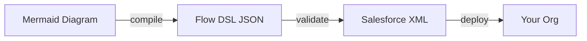
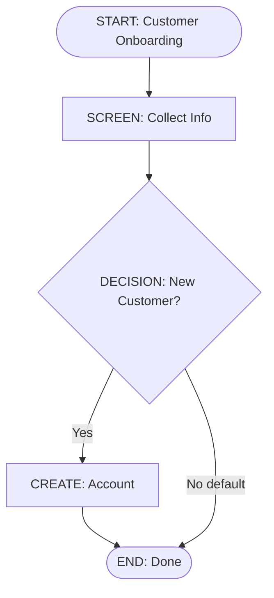

# Mermaid-to-Salesforce Flow Compiler

> **Turn Mermaid diagrams into deployable Salesforce Flows** - Version control, CI/CD, and AI-ready workflows for Flow development.

## What is this?

**Mermaid2SF** is a comprehensive toolkit for Salesforce Flow development that bridges the gap between visual flow design and production deployment. It consists of:

1. **CLI Compiler** - Convert Mermaid flowchart diagrams into production-ready Salesforce Flow XML metadata
2. **Web Visualizer** - Interactive drag-and-drop editor with live XML preview and diagram generation
3. **Flow DSL** - Intermediate JSON/YAML representation of Salesforce Flows (version-controllable, AI-friendly)
4. **Validation Engine** - Structural and semantic validation with actionable error messages
5. **Analysis Tools** - Complexity metrics, recommendations, and flow documentation generation

**The Problem:** Salesforce Flows are trapped in the Flow Builder UI—no version control, no code review, no CI/CD, no easy collaboration.

**The Solution:** Write flows as code (Mermaid diagrams), version control them like any other code, integrate with your CI/CD pipeline, and deploy with confidence.

### Who is this for?

- **Salesforce Developers** - Build, test, and deploy flows from the command line
- **Flow Architects** - Design flows visually, review in PRs, collaborate with teams
- **DevOps Engineers** - Automate flow deployment, enforce validation gates, track changes
- **AI/Automation** - Generate flows programmatically, analyze flow patterns, suggest improvements

---

## 🎯 Why This Tool?

**Problem:** Salesforce Flows live locked in the UI - hard to version control, review, or collaborate on.

**Solution:** Treat Flows like code with this compiler:



**Result:** Git workflows, pull requests, CI/CD, automated testing, and AI-powered analysis for your Flows!

---

## ⚡ Quick Demo (30 Seconds)

### 1️⃣ You have a diagram:



### 2️⃣ Run ONE command:

```bash
npm run cli -- compile --input my-flow.mmd --out-flow ./flows
```

### 3️⃣ Get deployable output:

```bash
✓ Compilation successful
  Flow XML: ./flows/my-flow.flow-meta.xml  ← Deploy to Salesforce!
  DSL JSON: ./flows/my-flow.flow.json     ← Version control!
  Docs: ./flows/my-flow.md                ← Auto documentation!
```

**[Quick Start Guide →](docs/QUICK_START.md)** - Get started in 2 minutes!

---

## Features

- ✅ **Full v1 Element Support**: Start, End, Assignment, Decision, Screen, RecordCreate, RecordUpdate, Subflow
- ✅ **Comprehensive Validation**: Structural + semantic validation with cycle detection
- ✅ **Documentation Generation**: Auto-generate Markdown docs and normalized Mermaid diagrams
- ✅ **Flow Analysis & Explain**: Analyze complexity, generate recommendations, and export reports (text/json/html)
- ✅ **Lint Command**: Validate flows without generating output
- ✅ **Interactive Mode**: Wizard to compile or create flows with live validation
- ✅ **Decompile Command**: Reverse Flow XML into DSL + Mermaid
- ✅ **Web Visualizer**: Drag/drop editor with live XML preview (syntax highlighting) and zoom/pan
  
- ✅ **Strict Mode**: Treat warnings as errors for stricter validation
- ✅ **Deterministic Output**: Same input always produces identical output (Git-friendly)
- ✅ **Performance Checked**: 50+ node flows parse/validate/generate in <3s locally
- ✅ **Hosted Frontend Ready**: Static UI can be served from `web/server/index.js` (open `/flow/` if you proxy WordPress on `/`)

---

## 🎨 Web Visualizer (Interactive Editor)

The **Web Visualizer** provides a complete drag-and-drop interface for building and editing Salesforce Flows visually:

### Features:
- **Toolbox**: Quick buttons to add Start, Screen, Assignment, Decision, GetRecords, End elements
- **Canvas**: Drag-and-drop visual flow builder with auto-layout
- **Nodes Panel**: Manage all flow elements with type labels
- **Live Preview**:
  - Mermaid diagram preview (real-time as you build)
  - XML preview with syntax highlighting
- **Export**: Download flows as Mermaid or DSL JSON
- **Compile & Preview XML**: Generate and preview Salesforce Flow XML instantly

### Try it now:
🌐 **[Open Web Visualizer](http://iotforce.es/flow/)** (Live Demo)

Or self-host:
```bash
npm run build
node web/server/index.js
# Open http://localhost:4000/flow/
```

---

## Quick Start

### Installation

```bash
npm install
npm run build
```

### Compile a Flow

```bash
# Compile Mermaid to Salesforce Flow XML
mermaid-flow-compile compile \
  --input examples/v1/complete-flow.mmd \
  --out-flow output/flows \
  --out-json output/dsl \
  --out-docs output/docs

# Or use npm script
npm run cli -- compile --input examples/v1/complete-flow.mmd --out-flow output/flows
```

### Validate a Flow

```bash
# Lint a single file
mermaid-flow-compile lint --input my-flow.mmd

# Lint all flows in a directory
mermaid-flow-compile lint --input flows/

# Strict mode (warnings as errors)
mermaid-flow-compile lint --input my-flow.mmd --strict
```

### Analyze a Flow

```bash
# Generate text summary with complexity analysis
mermaid-flow-compile explain --input my-flow.mmd

# Export JSON report for CI/CD integration
mermaid-flow-compile explain --input my-flow.mmd --format json

# Generate HTML report
mermaid-flow-compile explain --input my-flow.mmd --format html > report.html
```

## Commands

### `compile`
Compile Mermaid flowchart to Salesforce Flow metadata.

**Options:**
- `--input <path>` - Path to Mermaid file (required)
- `--out-flow <dir>` - Output directory for Flow XML
- `--out-json <dir>` - Output directory for DSL JSON
- `--out-docs <dir>` - Output directory for documentation
- `--dsl-format <format>` - DSL format: json or yaml (default: json)
- `--strict` - Treat warnings as errors
- `--verbose` - Verbose logging
- `--debug` - Debug logging, stage timings, debug artifacts in `.debug/`
- `--watch` - Watch input file and recompile on changes

**Example:**
```bash
mermaid-flow-compile compile \
  --input my-flow.mmd \
  --out-flow flows/ \
  --out-json dsl/ \
  --out-docs docs/ \
  --strict \
  --verbose \
  --debug \
  --watch
```

### `lint`
Validate Mermaid flowchart without generating output.

**Options:**
- `--input <path>` - Path to Mermaid file or directory (required)
- `--strict` - Treat warnings as errors
- `--verbose` - Verbose logging
- `--debug` - Debug logging and stage timings
- `--watch` - Watch file/directory and re-run lint on changes

**Example:**
```bash
mermaid-flow-compile lint --input flows/ --strict
```

### `explain`
Analyze and summarize Flow structure, complexity, and generate recommendations.

**Options:**
- `--input <path>` - Path to Mermaid (.mmd) or DSL (.json/.yaml/.yml) file (required)
- `--format <format>` - Output format: `text`, `json`, or `html` (default: `text`)
- `--strict` - Treat warnings as errors
- `--verbose` - Verbose logging
- `--debug` - Debug logging and validation timings

**Example:**
```bash
# Text summary (default)
mermaid-flow-compile explain --input my-flow.mmd

# JSON output for programmatic analysis
mermaid-flow-compile explain --input my-flow.mmd --format json

# HTML report
mermaid-flow-compile explain --input my-flow.mmd --format html > report.html

# Interactive wizard (compile existing or create new)
mermaid-flow-compile interactive
```

**Output includes:**
- Flow metadata (API name, label, process type)
- Element counts by type (Screens, Assignments, Decisions, etc.)
- Cyclomatic complexity metric
- Decision outcomes count
- Variables count
- Validation errors and warnings
- **Recommendations** for improving flow quality:
  - Complexity reduction suggestions
  - Variable declaration reminders
  - Validation issue resolution tips

**Example output (text format):**
```
Flow: Customer Onboarding (CustomerOnboarding)
Process: Autolaunched | API: 60.0
Start: Start_1 | Ends: End_Success, End_Failure
Elements: 12 (Screens 2, Decisions 3, Assignments 2, RC 1, RU 1, Subflows 1)
Outcomes: 8 | Variables: 5 | Cyclomatic: 4
Validation: 0 errors, 2 warnings
Warnings:
  - UNREACHABLE_ELEMENT: Element 'Update_Optional' is not reachable from Start
Recommendations:
  - Resolve validation warnings before deployment.
```

### `interactive`
Run an interactive wizard to compile existing Mermaid files or create a new flow skeleton with validation and ASCII preview.

**Options:**
- No flags required; prompts guide file selection and optional generation of XML/DSL/Docs.

**Example:**
```bash
mermaid-flow-compile interactive
```

### `decompile`
Reverse a Flow XML (`*.flow-meta.xml`) into DSL JSON and Mermaid.

**Options:**
- `--input <path>` - Path to Flow XML (required)
- `--out-json <dir>` - Output directory for DSL JSON
- `--out-mermaid <dir>` - Output directory for Mermaid

**Example:**
```bash
mermaid-flow-compile decompile \
  --input force-app/main/default/flows/MyFlow.flow-meta.xml \
  --out-json .generated/flows \
  --out-mermaid docs/flows
```

## End-to-end example

```bash
# Build
npm run build

# Compile a sample Mermaid to XML/DSL/docs
node dist/cli/index.js compile \
  --input examples/v1/complete-flow.mmd \
  --out-flow output/flows \
  --out-json output/dsl \
  --out-docs output/docs

# Decompile the generated XML back to DSL/Mermaid
node dist/cli/index.js decompile \
  --input output/flows/complete-flow.flow-meta.xml \
  --out-json output/dsl \
  --out-mermaid output/docs
```

Artifacts:
- Flow XML: `output/flows/complete-flow.flow-meta.xml`
- DSL JSON: `output/dsl/complete-flow.flow.json`
- Mermaid: `output/docs/complete-flow.mmd` (open in https://mermaid.live or VS Code)
- Markdown summary: `output/docs/complete-flow.md`

## API / OpenAPI

- Local API server: `node web/server/index.js` (defaults to port 4000) with `/health` and `/api/compile`.
- OpenAPI spec: `docs/openapi.yaml` (references `schemas/flow-dsl.schema.json` for DSL payloads).
- Validate the spec: `npm run openapi:validate`.

-### Web visualizer
- Serve the static UI directly from the Node server (included): start `node web/server/index.js` and open `http://<host>/flow/` if you proxy WordPress on `/` (adjust Apache/Nginx ProxyPass accordingly), or `/` if Node serves the root.
- Online demo: [http://iotforce.es/flow/](http://iotforce.es/flow/) (same UI backed by the live API).
- Backend endpoints: `/health` and `/api/compile` (used by the UI). Frontend uses `window.location.origin` as base URL.

## View the result without running commands

Pre-generated outputs live under `examples/output/` so visitors can inspect the full pipeline without compiling locally:
- Mermaid: [examples/output/complete-flow.mmd](examples/output/complete-flow.mmd)
- Flow XML: [examples/output/complete-flow.flow-meta.xml](examples/output/complete-flow.flow-meta.xml)
- DSL JSON: [examples/output/complete-flow.flow.json](examples/output/complete-flow.flow.json)
Input source diagram lives at [examples/v1/complete-flow.mmd](examples/v1/complete-flow.mmd).

Open the Mermaid file in https://mermaid.live, skim the XML in an editor, or diff the DSL/mermaid/XML pair to see the deterministic round-trip.

## Supported Flow Elements

| Element Type | Mermaid Shape | Prefix | Description |
|--------------|---------------|--------|-------------|
| Start | `([...])` | `START:` | Flow entry point |
| End | `([...])` | `END:` | Flow termination |
| Assignment | `[...]` | `ASSIGNMENT:` | Set variable values |
| Decision | `{...}` | `DECISION:` | Conditional branching |
| Screen | `[...]` | `SCREEN:` | Display UI to users |
| RecordCreate | `[...]` | `CREATE:` | Create Salesforce records |
| RecordUpdate | `[...]` | `UPDATE:` | Update Salesforce records |
| Subflow | `[[...]]` | `SUBFLOW:` | Invoke another flow |

GetRecords supports filters, field selection, and optional sorting:
```
GET: Accounts
 api: Get_Accounts
 object: Account
 field: Id
 filter: Name = 'Test'
 sort: Name desc
```

## Example Mermaid Flow


See `docs/MERMAID_CONVENTIONS.md` for complete syntax guide.

## Validation Features

### Structural Validation
- Exactly one Start element
- At least one End element
- Valid element references
- Decision outcomes (must have one default)

### Semantic Validation (v1 Usable)
- Variable reference checking
- Undefined variable warnings
- Cycle detection (infinite loops)
- Reachability analysis

### Strict Mode
Use `--strict` flag to treat warnings as errors:
```bash
mermaid-flow-compile compile --input flow.mmd --out-flow flows/ --strict
```

## VSCode Integration

The project includes JSON Schema integration for VSCode, providing autocomplete and validation for `.flow.json` files.

**Features:**
- ✅ Autocomplete for all Flow DSL properties
- ✅ Real-time validation with inline errors
- ✅ Hover documentation for fields
- ✅ Type checking for all element types

**Setup:**
The schema is automatically configured in `.vscode/settings.json`. When you open a `.flow.json` file in VSCode, you'll get full IntelliSense support.

**Usage:**
1. Create or open a `.flow.json` file
2. Start typing - VSCode will suggest valid properties
3. Hover over properties to see documentation
4. Validation errors appear as you type

## Development

### Scripts
```bash
npm run build     # Compile TypeScript
npm run dev       # Watch mode
npm test          # Run tests
npm run lint      # ESLint
npm run format    # Prettier
```

### Project Structure

```
src/
├── cli/
│   ├── index.ts           # CLI entry point
│   └── commands/
│       ├── compile.ts     # Compile command
│       ├── lint.ts        # Lint command
│       └── explain.ts     # Explain/analyze command
├── parser/                # Mermaid parser
├── extractor/             # Metadata extraction
├── dsl/                   # Intermediate model builder
├── validator/             # Flow validation (structural + semantic)
├── generators/
│   ├── flow-xml-generator.ts    # Salesforce Flow XML
│   └── docs-generator.ts        # Markdown + Mermaid docs
├── types/                 # TypeScript type definitions
└── utils/                 # Utility functions

examples/
├── poc/                   # Phase 1 examples
└── v1/                    # v1 Usable examples

docs/
├── ARCHITECTURE.md        # System architecture
├── MERMAID_CONVENTIONS.md # Mermaid syntax guide
└── PROJECT_PLAN.md        # Full project roadmap
```

## Test Coverage

```bash
npm test
```

Current coverage:
- **58 tests passing (100%)**
- **Integration Tests**: 24 tests (end-to-end pipeline for all v1 elements)
  - Complete flow with all 8 element types
  - Individual element type tests (Screen, RecordCreate, RecordUpdate, Subflow, Assignment, Decision)
  - Validation error detection
  - Deterministic output verification
  - Real-world example files (5 examples)
  - Documentation generation
- **Validator**: 16 tests (structural + semantic validation)
- **DocsGenerator**: 7 tests (Markdown + Mermaid generation)
- **Flow XML Generator**: 3 tests (XML generation, YAML export)
- **Parser**: 8 tests (edge parsing, node shapes, deterministic ordering)

## Exit Codes

- `0` - Success
- `1` - Validation errors (or warnings in strict mode)
- `2` - Internal errors (parsing, file I/O, etc.)

## Phase Status

### ✅ Phase 1 - PoC (Complete)
- Basic element types (Start, End, Assignment, Decision)
- Mermaid parser
- Metadata extraction
- DSL builder
- XML generation
- Structural validation
- CLI foundation

### ✅ Phase 2 - v1 Usable (Complete)
- Extended element types (Screen, RecordCreate, RecordUpdate, Subflow)
- Enhanced semantic validation
- DocsGenerator (Markdown + normalized Mermaid)
- Lint command
- Strict mode
- Comprehensive examples
- Documentation

### ✅ Phase 3 - Advanced DX (Complete)
- Reverse engineering (`decompile`) and round-trip tests
- Explain/analyze reports (text/json/html)
- Interactive CLI wizard
- Performance instrumentation and watch mode

### ✅ Phase 4 - Extensions (Core implemented; deploy optional)
- Advanced elements: Loop, Wait, GetRecords, Fault paths
- Web visualizer/editor with live XML preview
- Reverse XML parser to DSL/Mermaid
- YAML DSL export
- Deployment hosting is deferred

See `PROJECT_PLAN.md` for complete roadmap.

## 📚 Documentation & Resources

### **Getting Started:**
- 🚀 **[Quick Start Guide](docs/QUICK_START.md)** - From zero to working Flow in 2 minutes (start here!)
- 🏗️ **[Architecture Document](mermaid-flow-compiler-architecture.md)** - System design and spec
- 📝 **[CLAUDE.md](CLAUDE.md)** - Development guidelines and codebase overview
- 📋 **[Project Plan](PROJECT_PLAN.md)** - Complete roadmap and task tracking

### **Quick Commands:**
- ⚡ `npm run cli -- interactive` - Try interactive mode wizard
- 📊 `npm run cli -- explain --input examples/v1/complete-flow.mmd` - Analyze a flow
- ✅ `npm run cli -- lint --input examples/v1/` - Validate flows
- 🔄 `npm run cli -- compile --input my-flow.mmd --watch` - Watch mode

---

## 🌟 What Makes This Special?

### **For Solo Developers:**
- ✅ **Git-based workflow** - Version control your Flows like any other code
- ✅ **Local development** - Edit in VS Code with Mermaid preview
- ✅ **Fast iteration** - Watch mode for instant feedback

### **For Teams:**
- ✅ **Code reviews** - Pull requests with clear diffs in DSL JSON
- ✅ **Collaboration** - Multiple developers on same Flow without conflicts
- ✅ **Documentation** - Always up-to-date, auto-generated docs

### **For DevOps:**
- ✅ **CI/CD ready** - Automated validation, testing, deployment
- ✅ **Quality gates** - Strict mode prevents bad Flows
- ✅ **Performance** - Sub-second compilation for rapid pipelines

### **For AI/Automation:**
- ✅ **AI-friendly DSL** - ChatGPT/Claude can read, analyze, and suggest improvements
- ✅ **Programmatic** - Generate Flows from requirements automatically
- ✅ **Analyzable** - Complexity metrics, recommendations, pattern detection

---

## Contributing

See `CLAUDE.md` for development guidelines and codebase overview.

## License

MIT
