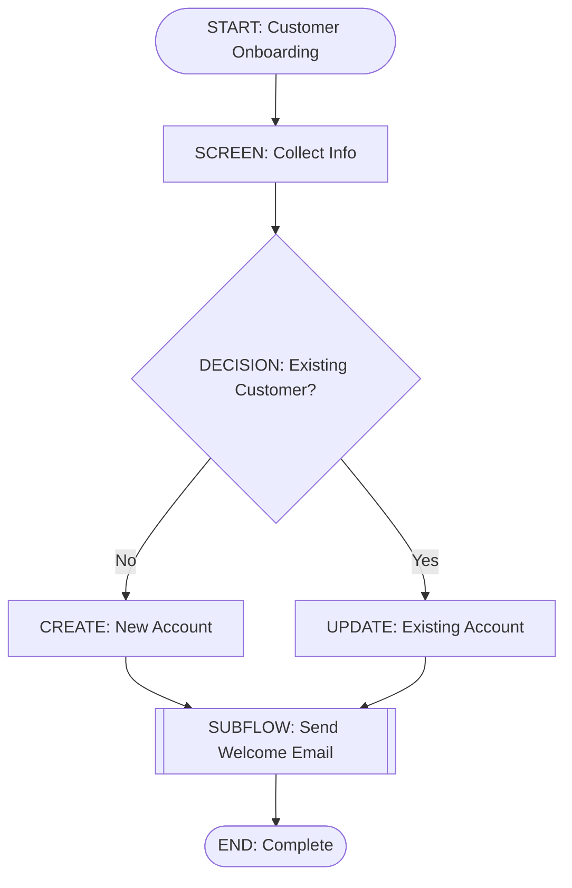

# How to Build Salesforce Flows Like Code: A Modern Developer's Guide

**An open-source tool that brings version control, CI/CD, and AI to Salesforce Flow development**

---

## The Problem: Salesforce Flows Are Trapped in the UI

If you're a Salesforce developer, you've probably experienced this frustration:

1. **No version control**: Your flows live only in your Salesforce org. No Git history, no rollback, no collaboration trail.
2. **No code reviews**: Unlike code, flows can't be reviewed in a pull request. Changes are invisible until deployed.
3. **No CI/CD**: You can't automate validation or testing. Every deployment is manual and risky.
4. **No collaboration**: Multiple developers can't work on the same flow without conflicts.
5. **AI is blind**: ChatGPT can't analyze or improve your flows because they're locked in a proprietary UI.

You write code in VS Code with Git, linters, and tests. But Salesforce Flows? You're back in 1995 with a visual drag-and-drop interface.

**It doesn't have to be this way.**

---

## The Solution: Flows as Code

What if you could write Salesforce Flows as **Mermaid diagrams** (simple text files), commit them to Git, review them in pull requests, and let CI/CD automatically validate and deploy them?

```
Your Mermaid Diagram (.mmd)
         ↓ [CLI Compiler]
    Flow DSL (JSON/YAML)
         ↓ [Validator]
    Salesforce Flow XML
         ↓ [Deploy]
    Your Org
```

**That's exactly what `mermaid-flow-compiler` does.**

---

## What is mermaid-flow-compiler?

**mermaid-flow-compiler** is an open-source Node.js CLI tool that:

1. **Parses Mermaid diagrams** - Write flows as visual diagrams using simple text syntax
2. **Generates Salesforce Flow XML** - Automatically creates production-ready `*.flow-meta.xml` files
3. **Validates flows** - Catches structural and semantic errors before deployment
4. **Generates documentation** - Auto-creates markdown docs and normalized diagrams
5. **Enables AI analysis** - DSL format that ChatGPT/Claude can read and improve
6. **Includes a web visualizer** - Drag-and-drop editor with live XML preview

**All 100% open-source. No vendor lock-in. MIT licensed.**

---

## Let's Build a Real Example

### Step 1: Write a Mermaid Diagram

Create a file called `customer-onboarding.mmd`:



**That's it.** This is a complete Salesforce Flow, but written as code.

### Step 2: Compile to Salesforce XML

```bash
npm run cli -- compile \
  --input customer-onboarding.mmd \
  --out-flow ./flows \
  --out-json ./dsl \
  --out-docs ./docs
```

**Output:**
```
✓ Compilation successful
  Flow XML: ./flows/customer-onboarding.flow-meta.xml
  DSL JSON: ./flows/customer-onboarding.flow.json
  Docs: ./flows/customer-onboarding.md
```

### Step 3: Deploy to Salesforce

```bash
# Using SFDX
sfdx force:source:deploy -m Flow:customer_onboarding

# Or with Hardis
hardis:package:deploy --flow-folder force-app/main/default/flows
```

**Done.** Your flow is now in production, and it's in Git.

---

## Why This Changes Everything

### For Individual Developers
- ✅ **Local development** - Edit flows in VS Code, test locally, commit to Git
- ✅ **Instant feedback** - Watch mode recompiles on every save
- ✅ **Reproducible** - Same Mermaid always produces identical XML (Git-friendly)

### For Teams
- ✅ **Code reviews** - Pull requests with clear diffs in DSL JSON
- ✅ **Collaboration** - Multiple developers work on different flows without conflicts
- ✅ **Documentation** - Always up-to-date, auto-generated docs

### For DevOps/Platform Engineers
- ✅ **CI/CD automation** - Validate flows before merge with GitHub Actions
- ✅ **Quality gates** - Enforce strict validation rules
- ✅ **Compliance** - Audit trail of all changes via Git
- ✅ **Performance** - Sub-second compilation for rapid pipelines

### For AI/Automation Enthusiasts
- ✅ **AI can read flows** - The DSL is structured, human-readable, and AI-friendly
- ✅ **Auto-generate flows** - Use ChatGPT/Claude to suggest improvements
- ✅ **Analyze patterns** - Detect complexity, find optimization opportunities
- ✅ **Refactor safely** - AI can suggest improvements with Git confidence

---

## Supported Flow Elements (v1)

The tool currently supports the most common Salesforce Flow elements:

| Element | Use Case |
|---------|----------|
| **Start** | Entry point of the flow |
| **End** | Exit point(s) |
| **Screen** | Display UI to users |
| **Decision** | Conditional logic (if/else) |
| **Assignment** | Set variable values |
| **RecordCreate** | Insert records into Salesforce |
| **RecordUpdate** | Update existing records |
| **Subflow** | Call another flow |

More elements (Loops, Waits, Fault paths) are planned for v2.

---

## Interactive Web Visualizer

While the CLI is powerful, we know developers love UIs. That's why we included a **web-based flow editor**:

- **Drag & drop canvas** - Build flows visually
- **Live XML preview** - See the generated Salesforce XML in real-time
- **Mermaid diagram** - Auto-generate the diagram as you build
- **Export** - Download as Mermaid, XML, or DSL JSON
- **Templates** - Start from pre-built flow templates

Try it live: **http://iotforce.es/flow/**

Or run locally:
```bash
npm run build
node web/server/index.js
# Open http://localhost:4000/flow/
```

---

## Real-World Benefits

### Before (Traditional Approach)
```
Developer writes flow in UI
  → Screenshots flow changes
  → Sends email to team
  → Manual validation in staging
  → Hope nobody breaks it in production
  → No rollback plan
```

### After (With mermaid-flow-compiler)
```
Developer writes flow as Mermaid in VS Code
  → Commits to feature branch
  → CI auto-validates and tests
  → Team reviews in pull request
  → Merge to main (green checks passed)
  → CD auto-deploys to production
  → Full Git history and audit trail
```

---

## Getting Started

### Installation

```bash
# Clone the repo
git clone https://github.com/krukmat/mermaid-flow-compiler
cd mermaid-flow-compiler

# Install and build
npm install
npm run build
```

### Quick Start

```bash
# Try an example
npm run cli -- compile \
  --input examples/v1/complete-flow.mmd \
  --out-flow output/flows

# Or use interactive wizard
npm run cli -- interactive

# Or analyze an existing flow
npm run cli -- explain --input my-flow.mmd
```

### Validate Without Generating Output

```bash
# Lint a single flow
npm run cli -- lint --input my-flow.mmd

# Lint all flows in a directory
npm run cli -- lint --input flows/ --strict
```

---

## The Roadmap

### ✅ Phase 1 - PoC (Complete)
- Basic elements (Start, End, Assignment, Decision)
- Mermaid parser
- XML generation

### ✅ Phase 2 - v1 Usable (Complete)
- Extended elements (Screen, RecordCreate, RecordUpdate, Subflow)
- Comprehensive validation
- Documentation generation
- Web visualizer

### 🚀 Phase 3 - AI Integration (In Progress)
- `explain` command for flow analysis
- AI-friendly DSL schema
- Programmatic flow generation

### 🔮 Phase 4 - Extensions (Planned)
- Advanced elements (Loops, Waits, Fault paths)
- Deep IDE integration
- Deployment automation

---

## Key Takeaways

1. **Salesforce Flows deserve better** - They should be in version control, reviewed in PRs, and tested like any other code.

2. **Mermaid diagrams are powerful** - Simple text syntax that's both human and machine-readable.

3. **You can start today** - The tool is production-ready and works with Salesforce v55+.

4. **The future is code** - Whether you're building Salesforce, AWS, or Kubernetes configs, infrastructure-as-code principles apply everywhere.

---

## Community & Contributing

This is **100% open-source**. We'd love your contributions:

- **Found a bug?** Open an issue on GitHub
- **Have a feature idea?** Create a discussion or PR
- **Want to improve docs?** Documentation PRs are always welcome
- **Built something cool?** Share it in discussions

**License:** MIT

---

## Resources

- **GitHub:** https://github.com/krukmat/mermaid-flow-compiler
- **Quick Start:** [5-minute guide](docs/QUICK_START.md)
- **Architecture Spec:** [Deep dive into design](mermaid-flow-compiler-architecture.md)
- **Web Visualizer:** [Try it live](http://iotforce.es/flow/)
- **Mermaid Syntax:** [Full diagram conventions](docs/MERMAID_CONVENTIONS.md)

---

## Questions?

- **How do I integrate this into my CI/CD?** See the CI/CD guide in the repo
- **Can I decompile existing Salesforce Flows?** Yes! Use the `decompile` command
- **What about advanced elements like Loops?** Phase 4 is planned. Follow GitHub discussions
- **Is this production-ready?** Yes. 100+ tests, real-world examples, and actively deployed

---

**Join the flow revolution. Your Salesforce development will never be the same.**

✨ *Happy flow coding!*
