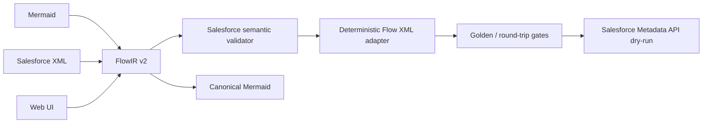

# Mermaid2SF — Project Compilation

## Executive summary

Mermaid2SF has evolved from a one-way Mermaid-to-XML proof of concept into a correctness-hardened, bidirectional compiler core for a documented subset of Salesforce Flow.

The architectural contract is now:

```text
Salesforce Flow XML ⇄ FlowIR v2 ⇄ Mermaid
```

Neither Mermaid nor Salesforce XML is treated as the source of truth. **FlowIR v2 is the canonical semantic model**, and every guaranteed feature must survive parsing, semantic validation, serialization, reverse import and semantic comparison.

## What was completed

| Wave | Capability | Result |
|---|---|---|
| W1 | Autolaunched Flow | Bidirectional guaranteed subset |
| W2A | Record-Triggered After Save | Create / Update / CreateAndUpdate |
| W2B | Record-Triggered Before Save | Fast Field Updates + Salesforce restrictions |
| W3 | Schedule-Triggered Flow | Once / Daily / Weekly, optional record context |
| W4 | Record-Triggered Before Delete | Delete trigger + related-record operations |
| W5 | Platform Event-Triggered Flow | Event payload through `$Record` |
| W6 | Screen Flow | Standard inputs, Display Text, navigation, defaults, static choices and simple visibility |

Each wave has its own proof document under `docs/WAVE*_PROOF.md` and a canonical Salesforce validation fixture.

## Compiler core now in place

The project now contains the pieces required to treat Flow metadata as a compiler problem instead of a text-generation problem:



### Canonical FlowIR v2

FlowIR models:

- Flow family and Salesforce process semantics separately,
- typed values: String, Boolean, Number, Date, DateTime, Reference and Null,
- structured conditions,
- typed resources/variables,
- record-trigger metadata,
- schedule-trigger metadata,
- Platform Event metadata,
- Screen navigation, typed defaults, static choices and visibility,
- supported business elements such as Assignment, Decision, Get/Create/Update Records and Subflow.

### Semantic validation

Salesforce-specific validation runs before XML serialization. Stable `M2SF-SF-*` diagnostics cover invalid Flow-family combinations, missing trigger/object metadata, invalid references, Before Save restrictions, Before Delete trigger pairing and Screen-specific constraints.

The goal is to reject metadata that looks plausible but is semantically invalid before it reaches Salesforce.

### Bidirectional fidelity

Guaranteed paths are tested semantically:

```text
Salesforce XML
   → FlowIR A
   → Mermaid
   → FlowIR B
   → Salesforce XML
   → FlowIR C

semanticDiff(A, B) == 0
semanticDiff(A, C) == 0
```

The guarantee is semantic, not byte-for-byte XML identity. Formatting, irrelevant XML ordering and synthetic terminal representation are normalized.

## Current verification baseline

After adding the executable README tour:

```text
Test suites: 45 / 45 passed
Tests:       354 / 354 passed
TypeScript:  build passed
Tour:        5 / 5 representative examples compile through FlowIR
```

## Salesforce verification

The CI pipeline contains an authenticated Salesforce Metadata API dry-run gate for every guaranteed Flow family/trigger variant.

Current externally validated fixtures:

- Autolaunched,
- Record-Triggered After Save,
- Record-Triggered Before Save,
- Schedule-Triggered,
- Record-Triggered Before Delete,
- Platform Event-Triggered,
- Screen Flow.

A successful local compilation is therefore not the only proof level: canonical fixtures also have a non-destructive validation path against Salesforce.

## Product capability after W6

Mermaid2SF can now serve three complementary workflows:

### 1. Flow-as-Code authoring

```text
Mermaid → FlowIR → validation → Salesforce XML
```

Flows become reviewable source artifacts with explicit Salesforce semantics.

### 2. Reverse engineering and documentation

```text
Salesforce XML → FlowIR → Mermaid
```

Existing Flow metadata can be transformed into a human-readable representation for documentation, review or agent consumption.

### 3. Round-trip change workflow

```text
Salesforce XML → Mermaid → edit/review → Salesforce XML
```

For the guaranteed subset, the compiler checks semantic equivalence rather than assuming that parseable metadata is lossless.

## What remains intentionally outside the guarantee

The compiler does **not** claim universal Salesforce Flow fidelity.

Important remaining boundaries include:

- Loop, Wait and Fault-path round-trip fidelity,
- Apex Actions,
- HTTP Callouts,
- Orchestration,
- advanced Screen components and layout,
- Dynamic / Record Choice Sets,
- multi-condition Screen visibility,
- metadata outside the documented Wave contracts.

These are expansion areas, not hidden assumptions inside the current guarantee.

## Resulting project position

The main architectural work is no longer “make Mermaid produce some Salesforce XML”. That problem is solved for the documented subset.

The project is now positioned around a stronger contract:

> **Represent Salesforce Flow semantics in a canonical model, expose them visually through Mermaid, and prove that supported transformations remain Salesforce-valid.**

The README provides a visual tour of the most representative execution models. The exact fidelity contract remains in [SUPPORTED_FEATURES.md](../SUPPORTED_FEATURES.md).
