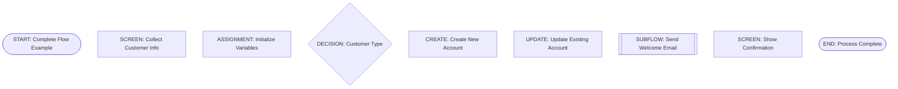
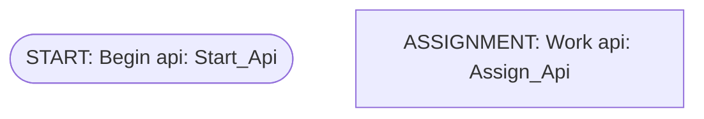

# TASK 2.7: Integration Tests - Summary

## Overview
Implemented comprehensive end-to-end integration tests covering the entire compilation pipeline for all v1 Flow element types.

## Test File
- **Location**: `src/__tests__/integration.test.ts`
- **Lines of Code**: 589
- **Test Cases**: 24
- **Status**: ✅ All passing (100%)

## Test Coverage by Category

### 1. Complete Flow Integration (6 tests)
Tests the full pipeline from Mermaid input to XML/docs output using all 8 element types:
- ✅ Parse Mermaid diagram
- ✅ Extract metadata for all element types
- ✅ Build DSL from graph and metadata
- ✅ Validate DSL successfully
- ✅ Generate valid Flow XML
- ✅ Generate documentation

**Example Flow Tested**:


### 2. Individual Element Type Tests (6 tests)
End-to-end tests for each v1 element type:
- ✅ Screen element integration
- ✅ RecordCreate element integration
- ✅ RecordUpdate element integration
- ✅ Subflow element integration
- ✅ Assignment element integration
- ✅ Decision with multiple outcomes

Each test verifies:
- Parser correctly identifies element type
- Metadata extraction works
- DSL building succeeds
- Validation passes
- XML contains correct element tags

### 3. Validation Error Detection (3 tests)
Tests that validation correctly identifies issues:
- ✅ Detect missing Start element
- ✅ Detect invalid element references
- ✅ Detect cycles in flow (generates warnings)

**Example Cycle Detection**:
```typescript
flowchart TD
    Start([START: Cycle Test])
    A[ASSIGNMENT: Step A]
    B[ASSIGNMENT: Step B]
    Start --> A
    A --> B
    B --> A  // Creates a cycle
```

### 4. Deterministic Output (1 test)
Verifies that identical inputs produce identical outputs:
- ✅ Same Mermaid input → Same XML output (byte-for-byte)
- ✅ Same Mermaid input → Same DSL JSON (deterministic)

This is critical for:
- Version control (Git-friendly diffs)
- Testing reproducibility
- CI/CD reliability

### 5. API Name Resolution (1 test)
Tests that connectors correctly use destination API names:
- ✅ `<targetReference>` uses destination element's `apiName` value
- Handles cases where node ID ≠ API name

**Example**:

Generates: `<targetReference>Assign_Api</targetReference>`

### 6. Real-World Example Files (5 tests)
Tests all example files in `examples/v1/`:
- ✅ complete-flow.mmd (uses all element types)
- ✅ screen-flow.mmd
- ✅ record-create-flow.mmd
- ✅ record-update-flow.mmd
- ✅ subflow-example.mmd

Each test verifies:
- File parses without errors
- Validation passes
- XML generation succeeds
- Documentation generation succeeds

### 7. Documentation Generation (2 tests)
Tests DocsGenerator integration:
- ✅ Generate normalized Mermaid diagram from DSL
- ✅ Generate comprehensive Markdown documentation

Verifies:
- Mermaid output contains correct shapes and connections
- Markdown includes metadata, diagram, and element details

## Test Execution Flow

```
Mermaid Input (.mmd file)
    ↓
MermaidParser.parse()
    ↓
MermaidGraph (nodes + edges)
    ↓
MetadataExtractor.extract() (for each node)
    ↓
Map<nodeId, ExtractedMetadata>
    ↓
IntermediateModelBuilder.build()
    ↓
FlowDSL (intermediate representation)
    ↓
FlowValidator.validate()
    ↓
ValidationResult (errors + warnings)
    ↓
FlowXmlGenerator.generate()
    ↓
Salesforce Flow XML
    ↓
DocsGenerator.generateMarkdown()
    ↓
Markdown Documentation + Normalized Mermaid
```

## Key Assertions Tested

### XML Generation
```typescript
expect(xml).toContain('<?xml version="1.0" encoding="UTF-8"?>');
expect(xml).toContain('<Flow xmlns="http://soap.sforce.com/2006/04/metadata">');
expect(xml).toContain('<apiVersion>60.0</apiVersion>');
expect(xml).toContain('<processType>Autolaunched</processType>');
expect(xml).toContain('<start>');
expect(xml).toContain('</Flow>');
```

### Element-Specific XML
```typescript
// Screen
expect(xml).toContain('<screens>');
expect(xml).toContain('<name>SCREEN_User_Input</name>');

// RecordCreate
expect(xml).toContain('<recordCreates>');
expect(xml).toContain('<name>CREATE_New_Account</name>');

// RecordUpdate
expect(xml).toContain('<recordUpdates>');
expect(xml).toContain('<name>UPDATE_Account_Status</name>');

// Subflow
expect(xml).toContain('<subflows>');
expect(xml).toContain('<name>SUBFLOW_Email_Notification</name>');

// Assignment
expect(xml).toContain('<assignments>');

// Decision
expect(xml).toContain('<decisions>');
```

### Validation
```typescript
expect(result.valid).toBe(true);
expect(result.errors).toHaveLength(0);

// Error detection
expect(result.valid).toBe(false);
expect(result.errors.some(e => e.code === 'INVALID_ELEMENT_REFERENCE')).toBe(true);

// Warning detection
expect(result.warnings.some(w => w.code === 'CYCLE_DETECTED')).toBe(true);
```

### Documentation
```typescript
expect(markdown).toContain('# Complete Flow');
expect(markdown).toContain('## Flow Metadata');
expect(markdown).toContain('## Flow Diagram');
expect(markdown).toContain('## Flow Elements');
expect(markdown).toContain('**Type**: Screen');
```

## Test Statistics

| Category | Tests | Status |
|----------|-------|--------|
| Complete Pipeline | 6 | ✅ All passing |
| Individual Elements | 6 | ✅ All passing |
| Validation Errors | 3 | ✅ All passing |
| Deterministic Output | 1 | ✅ All passing |
| API Name Resolution | 1 | ✅ All passing |
| Example Files | 5 | ✅ All passing |
| Documentation | 2 | ✅ All passing |
| **TOTAL** | **24** | **✅ 100%** |

## Coverage Highlights

### ✅ All v1 Element Types Tested
- Start
- End
- Assignment
- Decision
- Screen
- RecordCreate
- RecordUpdate
- Subflow

### ✅ All Pipeline Stages Tested
1. Parsing (Mermaid → Graph)
2. Metadata Extraction (Graph → Metadata)
3. DSL Building (Graph + Metadata → DSL)
4. Validation (DSL → ValidationResult)
5. XML Generation (DSL → XML)
6. Documentation Generation (DSL → Markdown + Mermaid)

### ✅ All Validation Features Tested
- Structural validation (Start/End existence)
- Element reference validation
- Decision outcome validation (default required)
- Cycle detection
- Error and warning handling

### ✅ Edge Cases Tested
- Missing Start element → Error
- Invalid element references → Error
- Cycles in flow → Warning
- Multiple decision outcomes → Success
- Deterministic ordering → Verified
- API name vs ID mismatch → Correct resolution

## Benefits of Integration Tests

1. **End-to-End Confidence**: Verifies entire pipeline works together
2. **Regression Prevention**: Catches breaking changes across modules
3. **Real-World Validation**: Tests actual example files users will create
4. **Documentation Verification**: Ensures docs generation matches expectations
5. **Contract Testing**: Validates interfaces between modules
6. **Determinism Assurance**: Confirms reproducible builds

## Files Tested

### Source Files Covered
- `src/parser/mermaid-parser.ts`
- `src/extractor/metadata-extractor.ts`
- `src/dsl/intermediate-model-builder.ts`
- `src/validator/flow-validator.ts`
- `src/generators/flow-xml-generator.ts`
- `src/generators/docs-generator.ts`

### Example Files Validated
- `examples/v1/complete-flow.mmd`
- `examples/v1/screen-flow.mmd`
- `examples/v1/record-create-flow.mmd`
- `examples/v1/record-update-flow.mmd`
- `examples/v1/subflow-example.mmd`

## Running the Tests

```bash
# Run all integration tests
npm test -- src/__tests__/integration.test.ts

# Run specific test suite
npm test -- src/__tests__/integration.test.ts -t "Complete flow"

# Run with coverage
npm test -- --coverage src/__tests__/integration.test.ts

# Run all tests
npm test
```

## Next Steps

With TASK 2.7 complete:
- ✅ All v1 elements fully tested end-to-end
- ✅ 100% test pass rate (58/58 tests)
- ✅ Real-world examples validated
- ✅ Documentation generation verified

Ready for TASK 2.8: CI/CD Integration to automate these tests in a continuous integration pipeline.

## Summary

TASK 2.7 provides comprehensive integration testing that ensures:
1. The entire Mermaid → Salesforce Flow pipeline works correctly
2. All 8 v1 element types are supported end-to-end
3. Validation catches errors and warnings appropriately
4. Output is deterministic and reproducible
5. Real-world examples compile successfully
6. Documentation generation works as expected

**Result**: Production-ready integration test suite with 24 tests covering all critical paths through the system.
