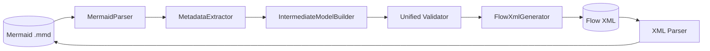
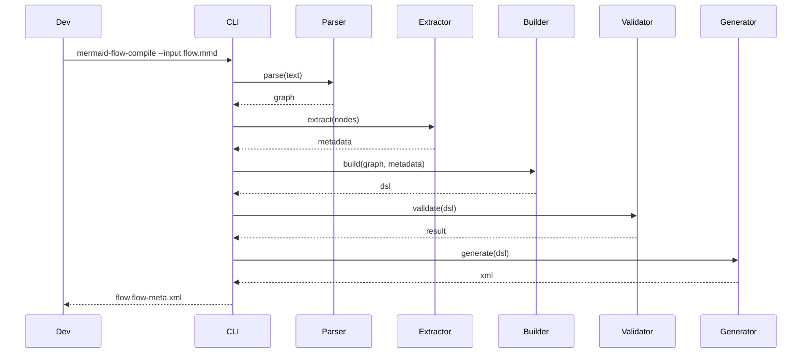
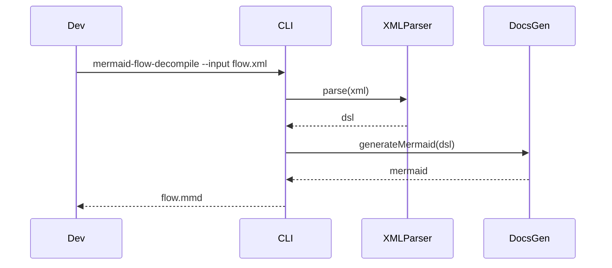
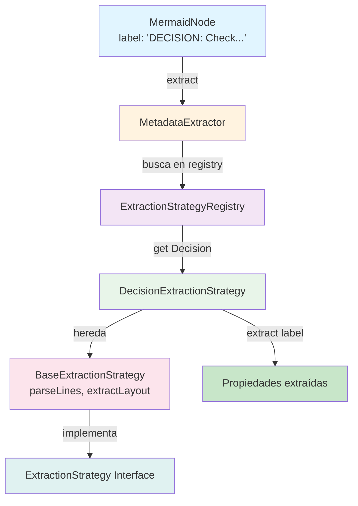

# Mermaid2SF Specification v2.0

> **Master Document**: Single source of truth consolidating all project specifications.
> **Audience**: Human developers and AI agents continuing this project.
> **Last Updated**: 2026-02-01

---

## Table of Contents

1. [Vision & Market Differentiation](#1-vision--market-differentiation)
2. [Architecture Overview](#2-architecture-overview)
3. [Use Cases](#3-use-cases)
4. [DSL Schema Reference](#4-dsl-schema-reference)
5. [Mermaid Conventions](#5-mermaid-conventions)
6. [Implementation Status](#6-implementation-status)
7. [Design Patterns](#7-design-patterns)
8. [Testing Strategy](#8-testing-strategy)
9. [Continuation Guide](#9-continuation-guide)

---

## 1. Vision & Market Differentiation

### 1.1 Problem Statement

Salesforce Flow development is locked inside Flow Builder:
- No version control for visual logic
- Documentation drifts from implementation
- Difficult structural reviews and diffs
- No AI integration for design/refactoring

### 1.2 Solution

**Mermaid2SF**: CLI compiler that enables:
```
Mermaid Diagram (.mmd) ←→ Intermediate DSL (JSON/YAML) ←→ Salesforce Flow XML
```

### 1.3 Unique Value Proposition

| Feature | Mermaid2SF | Competitors |
|---------|------------|-------------|
| Source of Truth | Diagram | XML/Metadata |
| Version Control | Native Git | Bolt-on |
| AI Integration | First-class | None |
| Round-Trip | 100% fidelity | Lossy |
| Visual Layout | Preserved | Lost |

### 1.4 Target Users

1. **Developers**: CLI-native workflow
2. **Architects**: Visual design + validation
3. **AI Agents**: Read/write DSL for automation
4. **CI/CD Systems**: Automated compilation + validation

---

## 2. Architecture Overview

### 2.1 Pipeline



### 2.2 Core Modules

| Module | Responsibility | Input | Output |
|--------|---------------|-------|--------|
| `MermaidParser` | Parse diagram text | `.mmd` text | Graph (nodes + edges) |
| `MetadataExtractor` | Extract element metadata | Graph nodes | Metadata map |
| `IntermediateModelBuilder` | Construct DSL | Graph + metadata | FlowDSL object |
| `Validator` | Validate structure/semantics | FlowDSL | Validation report |
| `FlowXmlGenerator` | Generate Salesforce XML | FlowDSL | `*.flow-meta.xml` |
| `DocsGenerator` | Generate documentation | FlowDSL | Mermaid + Markdown |
| `XMLParser` (Reverse) | Parse Flow XML | XML | FlowDSL |

### 2.3 File Structure

```
src/
├── cli/              # CLI entry point
├── parser/           # MermaidParser
├── extractor/        # MetadataExtractor + strategies
├── dsl/              # IntermediateModelBuilder
├── validator/        # Validator + rules
├── generators/       # FlowXmlGenerator, DocsGenerator
├── reverse/          # XML → Mermaid
├── types/            # TypeScript interfaces
└── utils/            # Helpers
```

---

## 3. Use Cases

### 3.1 UC1: Mermaid → Flow XML (Forward)

**Status**: Partially Implemented



### 3.2 UC2: Flow XML → Mermaid (Reverse)

**Status**: Proposed



### 3.3 UC3: Round-Trip 1:1

**Status**: Proposed

**Requirement**: `Mermaid → XML → Mermaid` produces identical output (diff = 0)

---

## 4. DSL Schema Reference

### 4.1 FlowDSL Structure

```typescript
interface FlowDSL {
  version: number;           // Schema version (1)
  flowApiName: string;       // Salesforce API name
  label: string;             // Display label
  processType: ProcessType;  // 'Autolaunched' | 'RecordTriggered' | 'Screen'
  apiVersion?: string;       // Salesforce API version (default: 60.0)
  startElement: string;      // ID of start element
  variables?: FlowVariable[];
  elements: FlowElement[];
}
```

### 4.2 Element Types

| Type | DSL Interface | Key Properties |
|------|---------------|----------------|
| Start | `StartElement` | next |
| End | `EndElement` | - |
| Assignment | `AssignmentElement` | assignments[], operator, valueType |
| Decision | `DecisionElement` | outcomes[], conditionLogic |
| Screen | `ScreenElement` | components[] |
| RecordCreate | `RecordCreateElement` | object, fields |
| RecordUpdate | `RecordUpdateElement` | object, fields, filters[], filterLogic |
| Subflow | `SubflowElement` | flowName, inputAssignments, outputAssignments |
| Loop | `LoopElement` | collection |
| Wait | `WaitElement` | waitType, duration, condition |
| GetRecords | `GetRecordsElement` | object, fields[], filters[] |
| Fault | `FaultElement` | - |

### 4.3 Common Properties (BaseElement)

```typescript
interface BaseElement {
  id: string;                        // Unique ID
  type: ElementType;                 // Element type
  apiName?: string;                  // Salesforce API name
  label?: string;                    // Display label
  next?: string;                     // Next element ID
  layout?: { x: number; y: number }; // Visual position
}
```

### 4.4 Decision Structure

```typescript
interface DecisionElement extends BaseElement {
  type: 'Decision';
  outcomes: DecisionOutcome[];
  conditionLogic?: string;  // 'and' | 'or' | custom
}

interface DecisionOutcome {
  name: string;           // Outcome name
  condition?: string;     // Condition formula
  isDefault?: boolean;    // Default outcome flag
  next: string;           // Target element ID
  label?: string;         // Display label
}
```

---

## 5. Mermaid Conventions

### 5.1 Node Syntax

```mermaid
%% General format:
NodeId[TYPE: Display Label
api: API_Name
key: value
layout: pos: x,y]
```

### 5.2 Element Examples

#### Start/End
```mermaid
Start([START: Flow Begins])
End([END: Flow Completes])
```

#### Assignment
```mermaid
Assign[ASSIGNMENT: Initialize
api: Assign_Init
set: v_Count = 0
op: v_Count = Add
valueType: v_Count = Number
layout: pos: 80,160]
```

#### Decision
```mermaid
Decision{DECISION: Evaluate
api: Decision_Eval
condition: v_Age >= 18
conditionLogic: and
layout: pos: 200,260}
```

#### Screen
```mermaid
Screen[SCREEN: Collect Info
api: Screen_Collect
field: Name (String)
field: Age (Number)
display: Enter details
layout: pos: 120,240]
```

#### RecordCreate
```mermaid
Create[CREATE: New Account
api: Create_Account
object: Account
field: Name = {!v_Name}
layout: pos: 300,200]
```

#### RecordUpdate
```mermaid
Update[UPDATE: Update Account
api: Update_Account
object: Account
filter: Id = {!v_AccountId}
filterLogic: and
field: Status__c = Active
layout: pos: 360,220]
```

#### Subflow
```mermaid
Subflow[[SUBFLOW: Send Email
api: Subflow_Email
flow: Email_Flow
input: email = {!v_Email}
output: v_Success = sent
layout: pos: 420,240]]
```

### 5.3 Edge Labels

```mermaid
Decision -->|Approved| NextStep
Decision -->|Fallback default| End
```

**Important**: Use `default` keyword to mark default outcome.

---

## 6. Implementation Status

### 6.1 Phase Completion

| Phase | Description | Status | Completion |
|-------|-------------|--------|------------|
| F0 | Gap Analysis | Done | 100% |
| F1 | Mermaid Conventions | Done | 100% |
| F2 | DSL/Schema | Done | 100% |
| F3 | Parser/Extractor | In Progress | 60% |
| F4 | XML Generator | Pending | 0% |
| F5 | Reverse | Pending | 0% |
| F6 | Tests + Docs | Pending | 0% |

### 6.2 Gap Analysis Summary

| Element | Missing in DSL | Missing in Extractor |
|---------|---------------|---------------------|
| All | - | layout extraction |
| Decision | - | conditionLogic (just added) |
| RecordUpdate | - | filterLogic |
| Assignment | - | operator, valueType (done) |

### 6.3 Current Blockers

1. **Layout extraction**: Not implemented in extractor
2. **XML Generator**: Not serializing new metadata fields
3. **Reverse parser**: Not started
4. **Golden file tests**: Not created

---

## 7. Design Patterns

### 7.1 Recommended Patterns

| Pattern | Module | Purpose |
|---------|--------|---------|
| **Strategy** | Extractor | Element-specific extraction logic |
| **Registry** | Extractor, Validator | O(1) lookup for strategies/rules |
| **Facade** | CLI | Orchestrate pipeline |
| **Chain of Responsibility** | Parser | Handle node types |

### 7.2 Strategy Pattern Implementation (F3 Phase)

**Architecture**: Cada tipo de elemento (Decision, Screen, Assignment, etc.) tiene su propia **estrategia de extracción** que hereda de una clase base común.

#### 7.2.1 Interface & Base Class

```typescript
// File: src/extractor/extraction-strategy.ts

// Contrato que todas las estrategias deben cumplir
export interface ExtractionStrategy {
  readonly elementType: ElementType;
  supports(label: string): boolean;
  extract(label: string): Record<string, any>;
}

// Clase base que proporciona helpers comunes
export abstract class BaseExtractionStrategy implements ExtractionStrategy {
  abstract readonly elementType: ElementType;
  abstract readonly typePrefix: string; // 'DECISION:', 'SCREEN:', etc.

  supports(label: string): boolean {
    return label.trim().toUpperCase().startsWith(this.typePrefix);
  }

  abstract extract(label: string): Record<string, any>;

  protected parseLines(label: string): string[] {
    // Parsea multilinea, maneja escapes
    return label
      .replace(/\\n/g, '\n')
      .split('\n')
      .map(l => l.trim())
      .filter(Boolean);
  }

  protected extractLayout(lines: string[]): { x: number; y: number } | undefined {
    // Extrae "layout: pos: 100,200"
    for (const line of lines) {
      const m = line.match(/layout:\s*pos:\s*(\d+)\s*,\s*(\d+)/i);
      if (m) return { x: parseInt(m[1], 10), y: parseInt(m[2], 10) };
    }
    return undefined;
  }
}
```

#### 7.2.2 Concrete Strategies

```typescript
// File: src/extractor/strategies/decision-strategy.ts
export class DecisionExtractionStrategy extends BaseExtractionStrategy {
  readonly elementType: ElementType = 'Decision';
  readonly typePrefix = 'DECISION:';

  extract(label: string): Record<string, any> {
    const lines = this.parseLines(label);
    const conditions: string[] = [];
    let conditionLogic: string | undefined;
    const layout = this.extractLayout(lines);

    for (const line of lines) {
      const condMatch = line.match(/condition:\s*(.+)/i);
      if (condMatch) { conditions.push(condMatch[1].trim()); }

      const logicMatch = line.match(/conditionLogic:\s*(\w+)/i);
      if (logicMatch) { conditionLogic = logicMatch[1].trim(); }
    }

    return { conditions, conditionLogic, layout };
  }
}

// Similar para: ScreenExtractionStrategy, AssignmentExtractionStrategy, etc.
```

#### 7.2.3 Registry

```typescript
// File: src/extractor/strategy-registry.ts
export class ExtractionStrategyRegistry {
  private readonly strategies = new Map<ElementType, ExtractionStrategy>();

  register(strategy: ExtractionStrategy): this {
    this.strategies.set(strategy.elementType, strategy);
    return this;
  }

  get(type: ElementType): ExtractionStrategy | undefined {
    return this.strategies.get(type);
  }

  has(type: ElementType): boolean {
    return this.strategies.has(type);
  }

  extractFor(type: ElementType, label: string): Record<string, any> {
    const strategy = this.get(type);
    return strategy ? strategy.extract(label) : {};
  }
}
```

#### 7.2.4 Integration in MetadataExtractor

```typescript
// File: src/extractor/metadata-extractor.ts
export class MetadataExtractor {
  private readonly registry: ExtractionStrategyRegistry;

  constructor(registry?: ExtractionStrategyRegistry) {
    this.registry = registry ?? this.createDefaultRegistry();
  }

  private createDefaultRegistry(): ExtractionStrategyRegistry {
    return new ExtractionStrategyRegistry()
      .register(new DecisionExtractionStrategy())
      .register(new ScreenExtractionStrategy())
      .register(new AssignmentExtractionStrategy())
      // ... más estrategias
  }

  private extractProperties(label: string, type: ElementType): Record<string, any> {
    if (this.registry.has(type)) {
      return this.registry.extractFor(type, label);
    }
    // Fallback para tipos no migrados aún
    switch (type) {
      case 'Start':
      case 'End':
      case 'Fault':
        return {}; // Tipos simples sin propiedades
      default:
        return {};
    }
  }
}
```

#### 7.2.5 Architecture Diagram



#### 7.2.6 Benefits

| Aspecto | Antes (sin Pattern) | Después (con Strategy) |
|---------|---|---|
| **Extensibilidad** | Modificar switch en MetadataExtractor | Crear estrategia, registrar |
| **Testabilidad** | Métodos privados + complejos | Estrategias independientes |
| **Mantenibilidad** | Switch gigante + duplicación | Clases separadas + DRY |
| **Lookup** | O(n) switch | O(1) Map |
| **Code Reuse** | Métodos repetidos | BaseExtractionStrategy |

### 7.3 Validation Rules

```typescript
interface ValidationRule {
  readonly name: string;
  readonly severity: 'error' | 'warning';
  validate(dsl: FlowDSL): ValidationIssue[];
}
```

---

## 8. Testing Strategy

### 8.1 Test Levels

| Level | Scope | Coverage Target |
|-------|-------|-----------------|
| Unit | Strategies, parsers | 90% |
| Integration | Full pipeline | 80% |
| E2E | Deploy to scratch org | Key paths |

### 8.2 Golden File Tests

```bash
# Expected structure
examples/
├── input/
│   └── complete-flow.mmd
└── output/
    ├── complete-flow.flow.json   # DSL
    └── complete-flow.flow-meta.xml  # XML
```

### 8.3 TDD Approach

1. Write test with expected output
2. Run test (should fail)
3. Implement feature
4. Run test (should pass)
5. Refactor if needed

---

## 9. Continuation Guide

### 9.1 How to Continue This Project

#### For AI Agents

1. Read this document first (MERMAID2SF_SPEC.md)
2. Check [PROPOSAL_ANALYSIS.md](./PROPOSAL_ANALYSIS.md) for improvement recommendations
3. Follow TDD: write test → implement → verify
4. Update this spec when making changes

#### For Human Developers

1. Run `npm test` to verify current state
2. Check `npm run lint` for code quality
3. Follow patterns in existing code
4. Commit with conventional commits

### 9.2 Phase Documents (Detailed Tasks)

> **IMPORTANT**: Detailed tasks are in **separate phase documents** to minimize context window for agents.

| Phase | Document | Status | Tasks |
|-------|----------|--------|-------|
| F3 | [phases/PHASE_F3.md](./phases/PHASE_F3.md) | IN PROGRESS | Parser/Extractor (7 tasks) |
| F4 | [phases/PHASE_F4.md](./phases/PHASE_F4.md) | PENDING | XML Generator (5 tasks) |
| F5 | [phases/PHASE_F5.md](./phases/PHASE_F5.md) | PENDING | Reverse XML→Mermaid (5 tasks) |
| F6 | [phases/PHASE_F6.md](./phases/PHASE_F6.md) | PENDING | Tests + Docs (6 tasks) |

**Agent Workflow**:
1. Check [phases/PHASE_INDEX.md](./phases/PHASE_INDEX.md) for current phase
2. Load **only** that phase's document (minimizes context)
3. Complete all tasks in order (TDD: test → implement → verify)
4. Mark phase DONE in index
5. Move to next phase

### 9.3 Verification Checklist

Before marking a task complete:

```bash
# 1. All tests pass
npm test

# 2. No lint errors
npm run lint

# 3. TypeScript compiles
npm run type-check

# 4. Coverage maintained
npm test -- --coverage
```

### 9.4 Code Quality Standards

- **Cyclomatic complexity**: Max 5 per function
- **Method length**: Max 30 lines
- **Test coverage**: Min 80%
- **TypeScript**: Strict mode enabled

### 9.5 Commit Message Format

```
feat(extractor): add layout extraction support

- Add extractLayout helper to extraction-utils
- Integrate layout parsing in Decision strategy
- Add unit tests for layout extraction

Co-Authored-By: Claude Opus 4.5 <noreply@anthropic.com>
```

---

## Appendix A: Quick Reference Commands

```bash
# Development
npm run dev              # Watch mode
npm run build            # Build TypeScript
npm test                 # Run all tests
npm run lint             # Check code quality
npm run type-check       # TypeScript validation

# CLI Usage
npm run cli -- --help
npm run cli -- --input flow.mmd --out-flow ./output
```

---

## Appendix B: Related Documents

| Document | Purpose | Keep/Archive |
|----------|---------|--------------|
| PROPOSAL_ANALYSIS.md | Improvement recommendations | Keep |
| mermaid2sf-handover.md | Previous handover | Archive after merge |
| mermaid2sf-analysis.md | Original analysis | Archive |
| mermaid2sf-*.md (others) | Superseded by this spec | Archive |

---

*This specification consolidates all project documentation into a single source of truth.*
*Version: 2.0 | Status: Active | Owner: Project Team*
